<!-- 
 -->

This guide takes you step by step through the use of the Shapeoko 3 CNC machine. It is mainly used for milling, a manufacturing process where the machine **removes material from a block (such as wood, metal or plastic) by rotating a cutting bit very quickly**. This makes it possible to create precise engravings and cuts in the material.

## Personal security
- Safety is paramount when using a CNC machine. Always follow these rules:
  - Never start the CNC machine with the protective cover open
  - Wear protective glasses
  - Wear hearing protection if necessary
  - Ensure that the ventilation system is functional
  - Never leave the machine unattended while it is operating

## Hardware reference

- CNC machine model used: <a href="/pdf/shapeoko3_assembly_guide.pdf" target="_blank" rel="noopener noreferrer">Shapeoko 3</a>
- Industrial compact router used: **DEWALT DWP611** (<a href="/pdf/dwp611.pdf" target="_blank" rel="noopener noreferrer">User manual</a>)
    - Collars available: **0,25" (6,35 mm)**
    - Several types of bits are available and can be installed on the router

    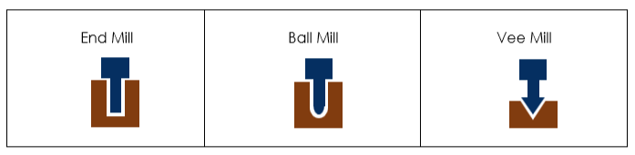

    - See below an example of the different bits available to insert into the collar

    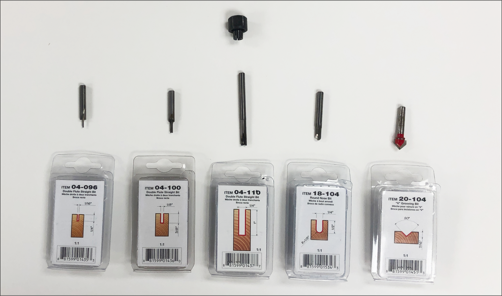

    - See below the **process of installing a bit into the collar**

    

- **Advanced users**: Update the firmware of the CNC machine periodically by connecting the CNC machine to your computer using a USB cable and using the Arduino IDE to upload the program
    - Firmware update: GRBL 1.1h (updated from version 1.1f) <a href="https://github.com/gnea/grbl/releases/tag/v1.1h.20190825" target="_blank" rel="noopener noreferrer">Firmware link</a>

## Work area

- The maximum cutting area of ​​the machine is indicated by sticky papers at the 4 corners of the machine
- The work surface is **30" (width) x 27" (length) (i.e. 76.20 cm x 68.58 cm)**

    

## Machinable materials

- Wood: All types of wood
    - Possible material cutting thickness: **1 inch (25.4 mm) and less**. It depends on the bits you use (**inspect the bits and their boxes**)
- Plastic
    - **Non-machinable** (We do not have a ventilation system to expel the fumes given off by the plastic)
- Metal
    - **Non-machinable**
- Copper plates
    - Copper plates (FR1 type) for creating printed circuits

## Software to use

Carbide 3D provides a **suite of 2 software** designed for its CNC machines (software available only in English):

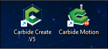

1. **Carbide Create**
   - To define the cutting parameters and generate the G-code file (the list of instructions that the CNC machine will have to follow)
2. **Carbide Motion**
   - To control the CNC machine and run the G-code file generated in Carbide Create

:::note[Note]
This guide explains how to operate the CNC machine to make a cut from an existing design, but it **does not cover creating vector designs**.
:::

## 1. Powering on the machine

Switches and buttons to start the machine are available on the left side:

1. Activate the switch **Interrupteur Principal**
2. Activate the switch **PC et CNC**
3. Press the button **Démarrer PC**
4. Activate the switch **Lumières**
5. **Do not touch** at the switch **Toupie** For now

## 2. Preparing the cutting board
- Measure the cutting board (width, length and thickness) using a tape measure **WITHOUT placing it on the work area for the moment**. This step will take place later.

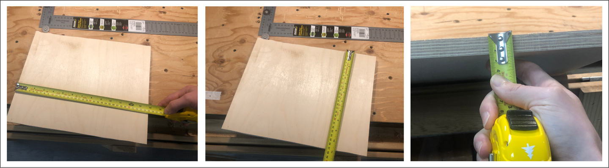

## 3. Using Carbide Create software
- Open the software

  

- Enter the dimensions of the board into the software
  - In the left menu, in the section **"Setup"** of the tab **"Design"**, click on the nut-shaped icon. A dialog box will open.

  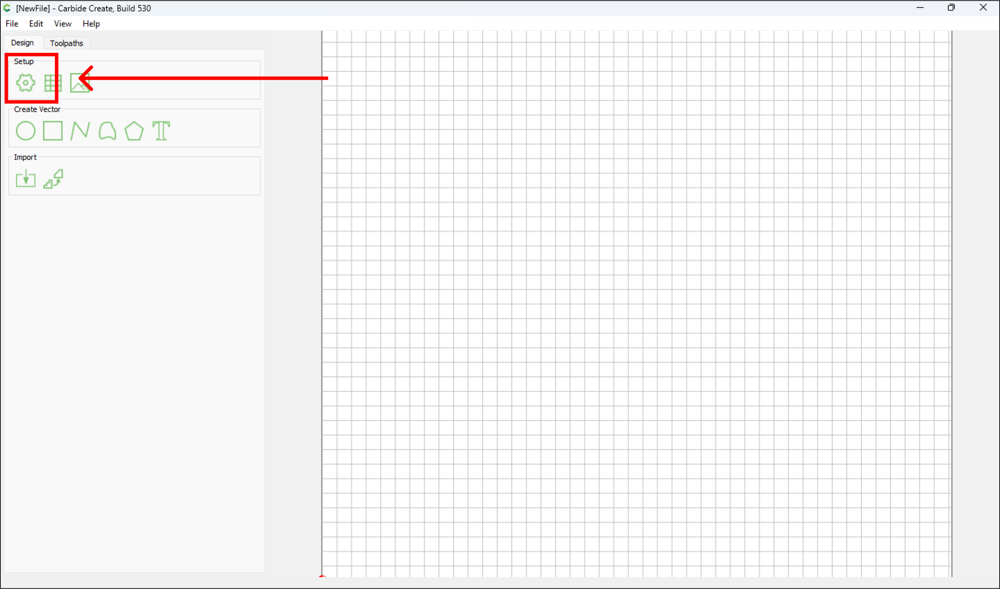

  

  - In this window, enter the width, length **«Stock Size»** and the thickness of your material **«Stock Thickness»** to be machined in millimeters. It is possible to change the unit of measurement in this window by clicking on the drop-down menu to the right of **«Units»** and selecting **«Inch»**.
    <!-- - (you can also use a unit converter if necessary such as <a href="https://www.wolframalpha.com/input?i=inch+mm" target="_blank" rel=" noopener noreferrer">wolframalpha.com</a>) -->
  - Do not touch the variable **«Zero Height»** who must stay on **«Top»** nor the section **«Toolpath Zero»** which corresponds to the initial position of the machine (the red zero point which corresponds to the place where the machine will begin its work). Usually it's the bottom left corner **«Lower Left»**.
  - Click on **«Ok»** to save the entered information. By clicking on **«Ok»**, the window will close and the work area will update to present a frame **representing the dimensions of your material** (shown in dotted lines below)

    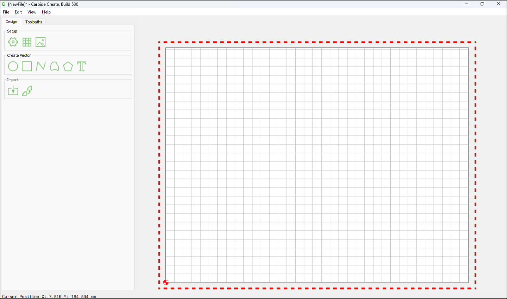

- Import the drawing to be machined
    - Then import your drawing to be machined to **vector format (.svg type file)** by clicking on the button **"Import"** of the section **"Import"**.
      - When you click, a dialog box will open and ask you to select the file to import. **Select file** and click on the button **"Open"**

    

    - You can now **check the dimensions of the imported design against the dimensions of your board**. If necessary, scale the drawing with the tool **"Scale"** in the section **"Transform"** and then position your drawing at the location on your board where you wish to carry out the machining

      

      

    - Click on **"Apply"** then on **"Done"**

- Now, configure the machining to be done on the chosen drawing
  - Select the different element(s) of the drawing. The drawing is displayed in orange when selected

    <!--  -->

    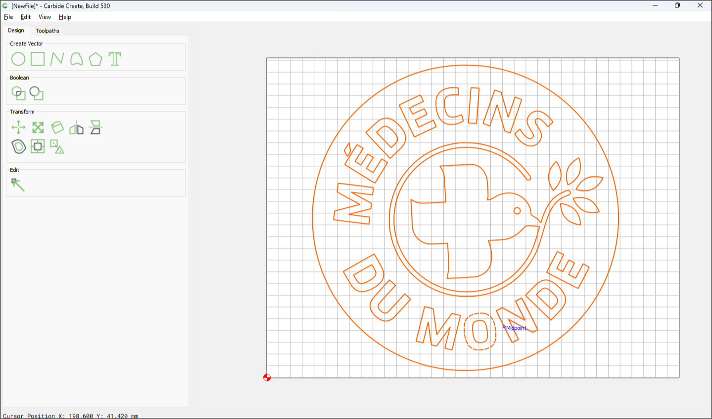

  - Then click on the tab **"Toolpath"** to the right of the tab **"Design"**
    - Several engraving options are available in the "2D Toolpath" section:

        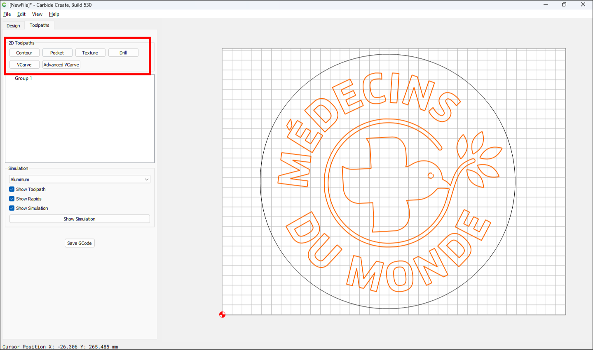

        - Select **«Contour»** to engrave the contours of the object
        - Select **«Pocket»** to hollow out the entire interior of the object evenly
        - Select **«Texture»** to dig inside an object to create a raised texture
        - Select **«Drill»** to make a hole in an object
        - Select **«VCarve»** to engrave the inside of an object producing angled sides (this option is mainly used for surface text)

    - Now that you have selected an engraving option for your project, all that remains is to select the choice of bit to use in the subsection **«Tool»** from submenu **«Contour Toolpaths»**

        

        - Click on **«Edit»** and a dialog box will open
        - Click on **«Select Tool»** allows access to the bits selection module available in the software

        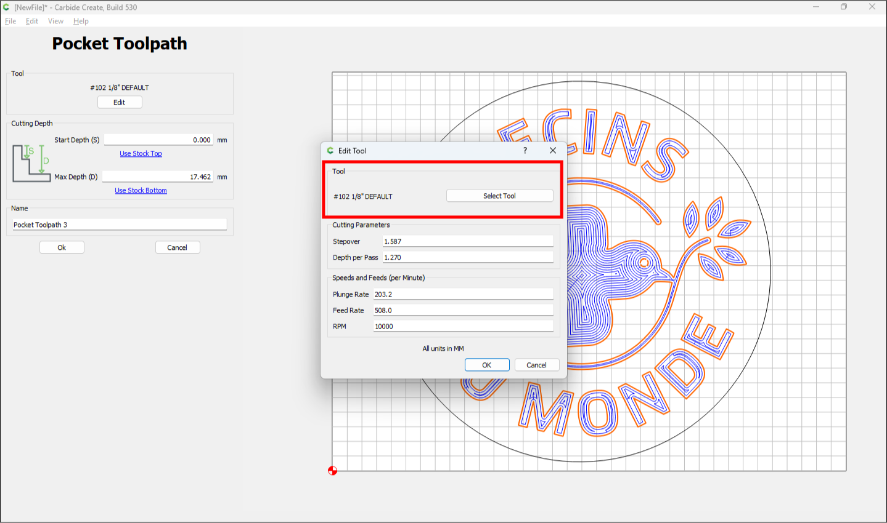

        

        - See below the **correspondence table** between the bits in the Carbide Create software selection module and the bits available in the workshop (shown in dotted lines below)

        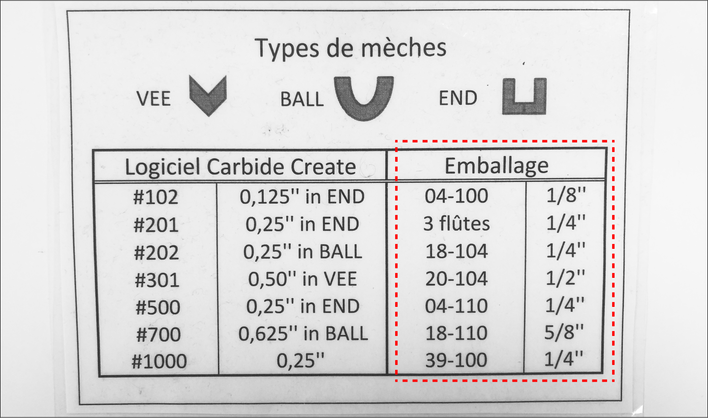

    - Then define the depth of the cut to be made in the section **« Cutting Depth »**. Make sure that the **bit that you are going to install in the router is sufficiently long** to make the cut at the entered depth.

        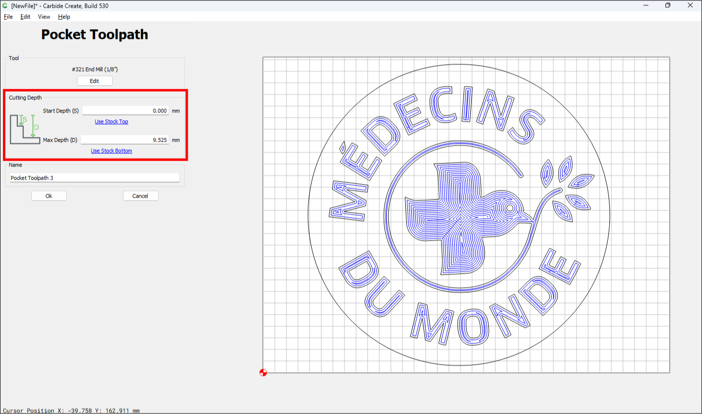

        - The first variable **«Start Depth» (S)** must be zero since we want to start milling on the surface of the material. The second variable, **«Max Depth» (D)** is the measurement of the maximum depth of the cut (By default, this distance is measured from the top of the board).
    <!-- - Set offset direction
        - This “Offset direction” section allows you to choose which side the bit will pass in relation to the cutting of your design.   -->
    - Once you have completed the different sections, click on **«Ok»**

:::note[Advice]
In the case of a complex drawing, you must define the order of cutting to be carried out for each group of drawings. For example, it is best to start by cutting the interior elements of a design before finishing with the exterior contours: This helps maintain the stability of the part during cutting.
:::

- Check the machine route by previewing it by pressing **« Show simulation »**
    - You can then see the simulation of the cutting

    

- Once the design cutout parameters have been configured, **save your work** And **export drawing in G-code format** by giving it a name (e.g. ma_decoupe_cnc.gcode)

    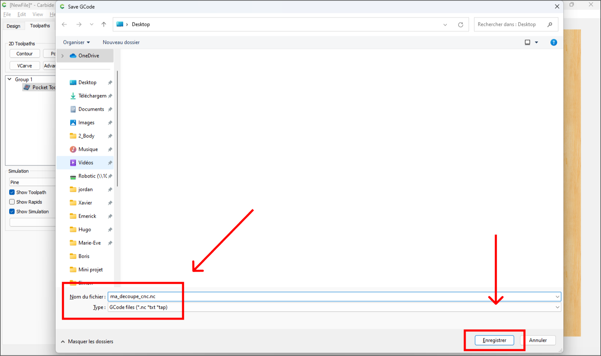

## 4. Using Carbide Motion software
- Before opening the software, first check that the **work surface of the CNC machine does not contain any objects or obstacles** on the work surface

    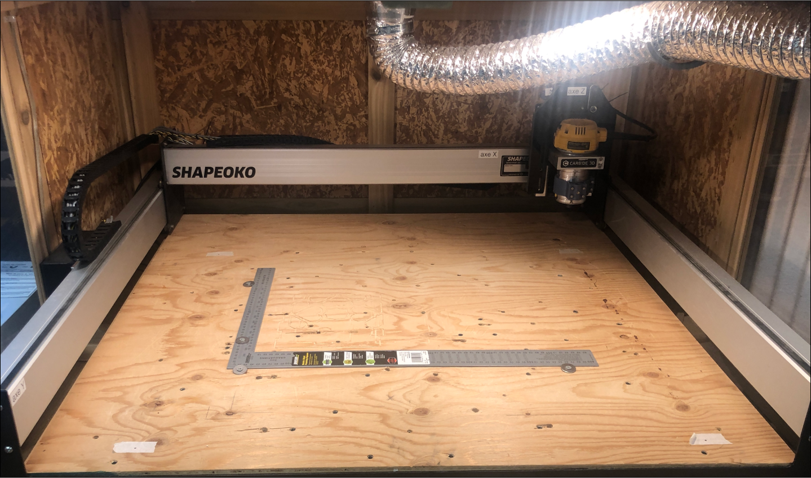

- Installing the bit on the router
    - Select the appropriate bit for your project
        - Make sure that the diameter of the tail of the bit corresponds to the collar installed on the router (the diameter of the tail of the bit must be **0,25″** inch or 6.35 mm)
    - Gently insert the tail of the bit into the corresponding collar of the router

        

    - Bit tightening
        - **Screw the collar with the drill bit** in the spinning top shaft
        - Locate the yellow lock button on the **left side of the top**
        - **Hold button** to prevent the shaft from rotating
        - Use a wrench to firmly tighten the collar nut into the **counterclockwise** (do not overtighten, to avoid damaging the collar or bit)
        - **Release** the yellow lock button

:::note[Note]
After releasing the yellow lock button, gently rotate the bit by hand to ensure it is **properly centered and does not wobble** in the collar. The bit is now correctly installed in the router!
:::

- On the compact router, select the rotation speed at which the bit should rotate depending on your project (**rotation speed between 1 and 6**)

  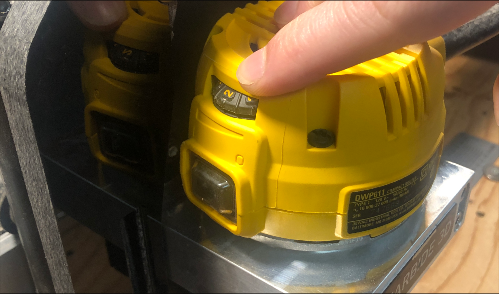

- Check out the below **correspondence table** between the setting of the selection wheel and the rotation speed of the router

  

- Open Carbide Motion software now

  

- Click on “Connect to cutter”

  

- Click on “Initialize machine”

  

:::caution
When you click on “Initialize machine”, the machine will **automatically move to initial position**, so she must not encounter any objects or obstacles on her way!
:::

:::note[Note]
Once the machine is in its initial position and is stopped, **position your cutting board on the work area using the fixing blocks**.
:::

- The fixing blocks will hold the board so that it does not move during machining

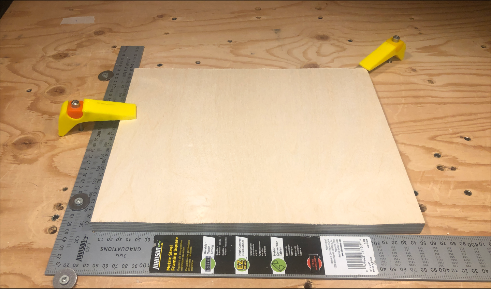

- Then click on the **“JOG”** tab
    - This tab allows you to manually control the router's movements on all axes (X, Y and Z) and is used to **set the starting point (zero point) of the CNC machine**

    

- Movement speed control
    - Locate the buttons **“INCREMENT +” and “INCREMENT -”** on the control interface. These buttons allow you to adjust the speed of movement of the router on the work surface.
    - The increment determines how precisely the router moves with each press of the X, Y, and Z movement buttons. Use these buttons to increase or decrease the increment as needed.
- Choice of speed
    - For rapid movement: Gradually increase the increment until **«FAST»** (use this option with caution, especially near the edges of the board.)
    - For a precise adjustment: Decrease the increment until **«0.025mm»**. This allows very fine control of the positioning of the router.
- Position the starting point of the machine

  - Adjustment on the X and Y axes: Use the controls on the tab **"JOG"** to move the router on the X and Y axes in order to **position the bit at the desired starting position on the board**.

  - The router is placed in its starting position:

    

  - Z-axis adjustment: Use the Z-axis controls to adjust **gently lower the router until the bit touches the surface of the board**.

    :::caution
    Be careful when lowering the head with the bit. Too rough contact could damage the bit or the board.
    :::

    :::note[Note]
    Use a standard sheet of paper as a thickness gauge. The bit should just pinch the paper without tearing it.
    :::

    

- Final check: Visually confirm that the starting position of the bit is correct on all axes.

    :::caution
    Make sure that the mounting blocks do not end up in the path of the bit when cutting.
    :::

- Once the positioning of the machine has been verified:
  1. Click on **"Set Zero"**
  2. Click on **"Done"** to confirm the positioning of the CNC machine in its starting position

:::note[Trick]
You can **write down (or take a photo) the final position of the router on the X, Y and Z axes**. This may be useful for future reference or in case you need to reset the machine.
:::

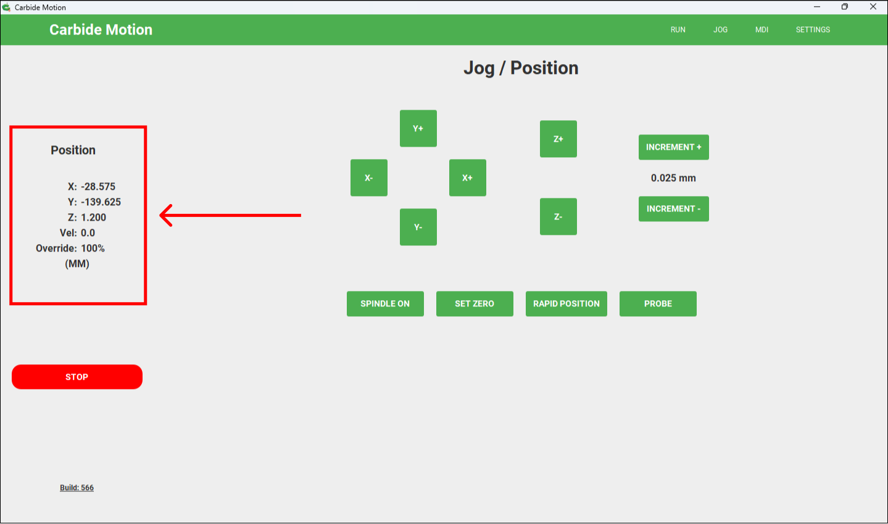

- Then click on **"RUN"**
  - Select **"Set current location as zero"**
  - Click on **"LOAD NEW FILE"**
  - Open the G-code file generated (e.g ma_decoupe_cnc.gcode) in the previous step with Carbide Create
  - Click on **"Done"**

- Place the vacuum cleaner on the router

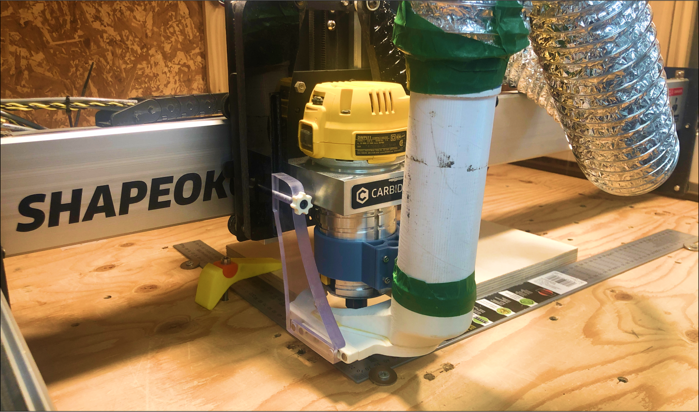

- Check that the ventilation hatch on the back of the CNC machine is **completely open**

- Turn on the ventilation system inside the metal cabin

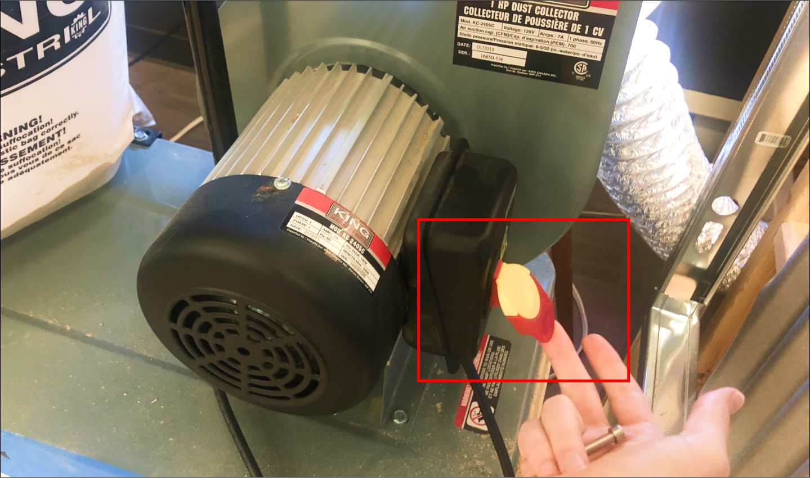

- Close the protective cover of the CNC machine

:::danger[Attention]
Never start the CNC machine with the protective cover open
:::

- Now activate the switch labeled **Toupie** on the left-hand side of the CNC Machine.
    - The spinning top will then **spin according to the rotation speed you previously set on the router** (reminder: rotation speed between 1 and 6)

- Start the machine now
    - Click on **"START JOB"**
    - Click on **"START"**
    - Confirm by clicking again **"START"**
    - Click on **"Resume"**

:::note
The CNC machine will now **carry out the machining of your part following the instructions in the G-code file**. During machining, the cutting progress and estimated remaining time are **displayed in real time** in the software.
:::

:::danger[Attention]
- **Never leave the machine unattended** during its operation
- In the event of an abnormality or danger, immediately use the **emergency stop button “Interrupteur Principal”** on the left of the machine or via the interface by clicking on the button **"STOP"** in the Carbide Motion software.
:::

## 5. Cleaning after use

:::caution
Make sure the machine has finished its work and is **stopped and turned off** before starting cleaning
:::

1. Stopping and securing:
   - Deactivate the router by pressing the **"Toupie"** switch and wait for it to stop completely
2. Opening and withdrawal:
   - Open the machine’s protective cover
   - Remove the mounting blocks and remove the machined board from the CNC machine housing
3. Cleaning:
   - Use the vacuum cleaner to remove wood chips and dust
   - Clean the guide rails with a clean cloth
   - Clean the router head
   - Once cleaning is complete, switch off the ventilation system
   - Switch off ventilation system
4. Switch off the computer:
   - Deactivate the **"PC et CNC"** switch

## To go further

- Consult the <a href="https://docs.carbide3d.com/" target="_blank" rel="noopener noreferrer">official Carbide 3D documentation</a> for detailed software and hardware information.

- A 3D printed adapter is installed on the router shaft to use markers (Sharpie type) instead of bits. This adapter will allow you to **draw on supports such as paper or wood, instead of performing a milling operation**.