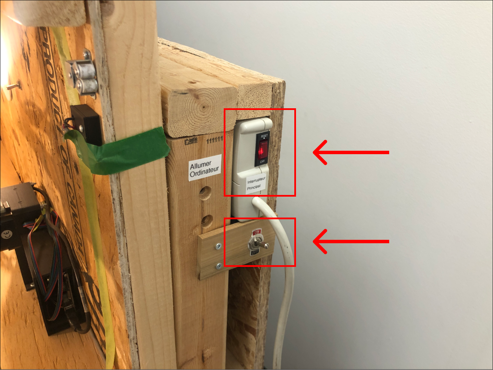

This guide takes you step by step through the use of the laser engraver. It is mainly used for engraving materials by using a focused laser beam that creates surface markings depending on power and speed settings.

## Personal security

- Safety is critical when using the laser engraver. It is therefore mandatory to follow these rules:
  - Always wear protective glasses rated for laser
  - Never look directly at the laser beam without protective glasses
  - Never operate the laser engraver with the protective cover open
  - Ensure the ventilation system is running before starting any job
  - **NEVER leave the machine unattended** while operating as a fire could start and spread quickly
- Before using the laser engraver, locate the nearby **fire extinguisher**, **fire-retardant blanket** and **protective glasses**.    
    
    
    

## Hardware reference

- Laser specifications:
    - Laser type: Diode laser module N40630
    - Power: 5W (optical output)
    - Wavelength: 450nm (blue)
    - Beam characteristics:
        - Focus spot: ~0.1mm
        - Beam shape: Elliptical
- The Laser focal length we typically used is 2.5"
- The specifications for the laser module used are based on the details listed on the <a href="http://wiki.nejetool.com/doku.php?id=laser_module_406030w" target="_blank" rel="noopener noreferrer">NEJE Wiki Laser Module Specifications Page</a>. Please consult the reference page for additional information about installation and maintenance.

## Glossary
- **G-code**: A programming language used to control automated machine tools
- **Vector file (SVG)**: A type of image file that uses mathematical formulas to create graphics, ideal for logos and text
- **Raster file (PNG, JPG)**: A type of image file made up of pixels, best for photographs
- **Focal length**: The optimal distance between the laser and material for best engraving results

## Work area
- The work surface, indicated by tape markings on each corner, is 29.5" (width) × 26" (length) (i.e., 74.93 cm × 66.04 cm). The material size that can fit the enclosure can be up to 36" × 36".

    

- The laser module can be adjusted on the Z-axis using the following range: 0-30mm

## Machinable materials

- Allowed Materials
    - All types of wood
        - Natural wood
        - Plywood
        - MDF
    - Paper and Cardboard
    - Leather and Fabrics
        - Natural leather only (undyed or without chromium)
- Prohibited materials
    - Plastic
        - Not allowed due to the absence of a ventilation system to handle harmful fumes
    - Metal
        - The diode laser is insufficiently powerful to engrave metal
    - Any reflective metals : glass

## Software workflow

To operate the laser engraver, we currently use **LaserWeb**, an open-source software designed to control laser cutters.

The laser engraving workflow consists of:
1. Preparing the design (vector or raster file)
2. Importing the design into LaserWeb
3. Verifying or resizing the dimensions of the design
4. Setting the engraving parameters
5. Generating the G-code for the machine
6. Executing the job
7. Safely shutting down the machine

## 1. Powering on the machine

The laser engraver has **multiple control switches located on different parts of the machine**.

- Front Panel Controls:
  
  - **Main power switch** : this switch turn on the computer.
  - **Laser server switch** : This switch activate the laser machine control server. Use it only once the computer has fully booted.
- Top-Mounted Controls:
  
  - An air assist compressor is located on the top right of the machine and used to provide a focused air stream to cool the material during engraving
    - Do not activate yet - we will turned it on before starting the job
- Inside enclosure
  
  - The Laser enable switch is Located on the right inner wall of the enclosure and provides power to the laser diode module
    - Do not activate yet - we will turned it on before starting the job

## 2. Using LaserWeb software

- Open LaserWeb from the desktop shortcut

  

- Import the design:
  - Click the "Add Document" button and select the design to use.
  
    - Supported formats:
        - Vector (SVG): Best for logos, text, and line art
        - Raster (PNG, JPG): Best for photographs images
  - Once the design is added, you can visualize it on the page.
  

- Adjust the design size
  - Select the design and look at the current dimensions of the imported design (in mm) in the properties panel. To resize it, simply select the design from the sidebar and enter the new dimensions in millimeters in the dialog box.
  

- Adjust the position of the design in the workspace
  - Select the design and click on the top-right arrow icon to align the design with the machine origin
  

- Configure the engraving settings
    1. Then, select the design and drag and drop it into the **GCODE** section
      
    2. Select amongst various operation type (In this example, we select **Laser Fill Path**):
      
        - Laser Fill path: For filling solid areas (recommended for most engraving operations involving vector files)
        - Laser Raster Merge: For creating detailed grayscale images
        - Laser Cut Outside: For for cutting along the outer perimeter of designs in laser engraving, creating clean outlines around the engraved pattern
    3. Set the engraving parameters:
        - Line Distance (mm): Defines the spacing between engraving lines. Smaller spacing improves resolution but increases processing time (we usually set 0.2)
        - Laser Power (0-100%): adjusts laser intensity.
        - Passes: Specifies how many times the laser will trace over the same area
        - Cut Rate (in mm/s): Determines how fast the laser moves. Slower speeds create deeper engravings but may burn the material.
        
        
        :::note[Advice]
        The engraving parameters shown above are used to engrave a logo (SVG format) on plywood.
        Please note that each material may require unique engraving parameters.
        :::

    4. Preview engraving
        1. Click on the **Generate Gcode** button
        
        2. On the workspace, uncheck **Show Gcode** and **Show Documents**. Keep only **Show Laser** checked to allow you to preview the laser engraving job.
        

## 3. Material preparation

- Material preparation
  - Clean the material surface to remove any dust or debris
  - Ensure the material to engrave is flat
- Positioning on the bed
  - Place the material on the laser engraver bed, away from bed edges
  - Align material parallel to machine axes when possible
  - Height adjustment (Z-axis): 
    - If necessary, use spacer blocks to raise the material’s surface. Adjust the height so the material’s top surface is approximately 1 to 2 inches from the laser head tip.
  

## 4. Laser Head Positioning

- Connect to the Laser machine
    - Go to the **Comms** tab and click on the **Connect** button
    
- Initial positioning
    - Go now to the **Control** tab
    - Click on the **home all** icon to move the laser to the machine origin (bottom left) and **wait for the movement to complete** before activating the laser switch.
    
    - **Activate the laser switch** inside the enclosure
        
        :::danger
        Always wear safety glasses before activating the laser.
        :::

- Laser alignment
    - Enable the laser pointer by clicking on **Laser Test**
    
    - Position the laser head on the X and Y axes
      - Use the control tab to move the laser on the X and Y axes in order to **position the laser at the desired starting position on the material**.
    
    - Position the laser head on the Z-axis
      - The **jog by** buttons controls how far the laser moves with each press of the directional buttons on the X, Y and Z axis.
      
      - Use the controls to gently lower the laser until there is **exactly 1 inch** between the laser tip and the material to engrave.
      

- Final setup
    - Once the laser head is properly positioned on the three axes, click on the **Set Zero** button to save the laser position
    
    - Finally, click the **Check Size** button to verify that the laser correctly trace the design outline on the material.
    
        :::note[Advice]
        You can click on the **Check Size** button several times if needed for clear visual confirmation of the laser outline.
        :::

## 5. Running the job

- Activate the air assist compressor located on the top right of the machine

- Check that the ventilation hatch on the back of the Laser machine is **completely open**

- Turn on the ventilation system inside the metal cabin

- Close the enclosure of the laser machine

    :::danger[Attention]
    Never start the laser engraving machine with the protective cover open
    :::

- Start the machine by clicking **Start job**

    

    :::note
    The laser machine will now **begin the engraving process**. The number of remaining instructions will be **displayed in real-time** within the software on the **Queued section**.
    :::

- You can always monitor the engraving process through the window located at the top of the enclosure (again, always use your safety glasses whenever you look at the laser module)

:::danger[Attention]
- **NEVER leave the machine unattended** during its operation
- In the event of an abnormality or danger, immediately use the **main power switch** on the front panel of the machine or via the LaserWeb software by clicking on the **abort job** button.
:::

## 6. Cleaning after use

:::caution
Make sure the machine has finished its work and is **stopped** fully and wait for ventilation to **clear smoke/fumes** before opening the enclosure and removing your engraved material
:::

- Allow material to cool before removing or handling them
- Turn off systems in reverse order:
    - Air compressor
    - Ventilation
    - Laser switch
    - Laser server
    - Main power

## 7. Maintenance

Although this module adopts an internal air-assisted design, long-term use may not prevent dust or a small amount of smoke from affecting the lens. It is recommended to clean the lens with a clean cotton swab and isopropyl alcohol. Dust or smoke may overheat the lens and cause the lens to burn out.

## Troubleshooting

Common issues and solutions:

- **Laser going too slow** : Check that the **Speed unit** (speed at which the laser head move) in **mm/s or mm/min** is set appropriately for the values you have entered.
- **Uneven engraving depth** : Verify that the material surface is perfectly flat and check if the focal length is correctly set
- **Poor image quality** : Ensure proper file format (vector for text/logos, raster for photos) and verify resolution of the design
- **Machine not responding** : Check all power switches are on, Verify computer-machine connection, Restart LaserWeb software

## To go further

- Consider experimenting with other software options for operating the laser machine to explore additional features offered by laser engraving programs (e.g., LightBurn, LaserGRBL, etc.).