<!-- 
 -->

Ce guide vous accompagne pas à pas dans l'utilisation de la machine CNC Shapeoko 3. Celle-ci est principalement utilisée pour le fraisage, un procédé de fabrication où la machine **enlève de la matière d'un bloc (comme du bois, du métal ou du plastique) en faisant tourner très rapidement une mèche coupante**. Cela permet de créer dans le matériau des gravures et des découpes précises.

## Sécurité personnelle
- La sécurité est primordiale lors de l'utilisation d'une machine CNC. Suivez toujours ces règles :
  - Ne jamais démarrer la machine CNC avec le capot de protection ouvert
  - Porter des lunettes de protection
  - Porter des protections auditives au besoin
  - S'assurer que le système de ventilation est fonctionnel
  - Ne jamais laisser la machine sans surveillance pendant son fonctionnement

## Référence matérielle

- Modèle de machine CNC utilisée : <a href="/pdf/shapeoko3_assembly_guide.pdf" target="_blank" rel="noopener noreferrer">Shapeoko 3</a>
- Toupie compacte industrielle utilisée : **DEWALT DWP611** (<a href="/pdf/dwp611.pdf" target="_blank" rel="noopener noreferrer">Manuel d'utilisation</a>)
    - Collets disponibles : **0,25" (6,35 mm)**
    - Plusieurs types de mèches sont disponibles et peuvent être installées sur la toupie

    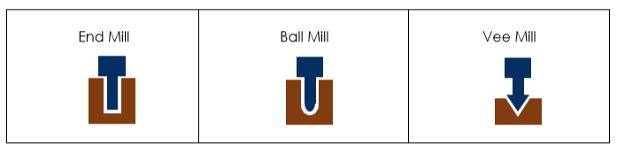

    - Voir ci dessous un exemple des différentes mèches disponibles à insérer dans le collet

    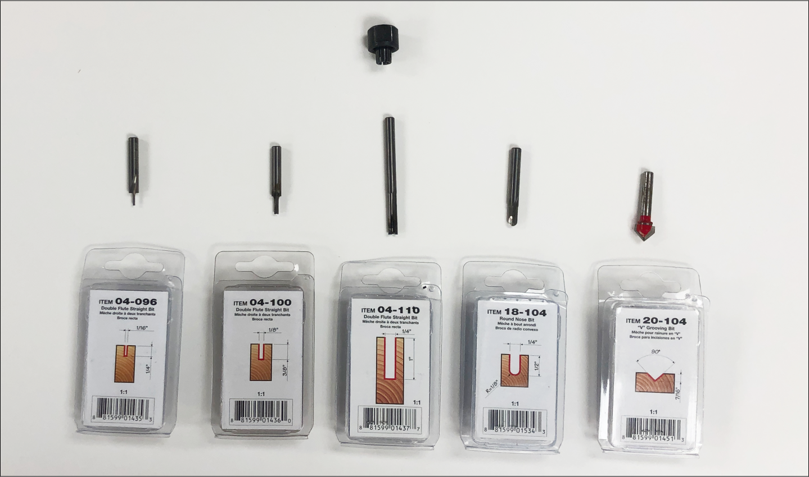

    - Voir ci dessous le **processus d'installation d'une mèche dans le collet**

    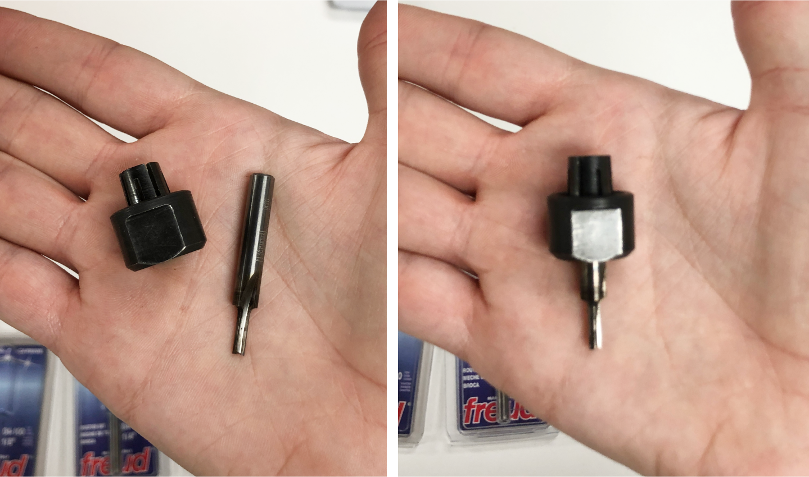

- **Utilisateurs avancés**: Mettre à jour le firmware de la machine CNC périodiquement en connectant la machine CNC à votre ordinateur en utilisant un câble USB et en  utilisant l'IDE Arduino pour téléverser le programme
    - Mise à jour Firmware : GRBL 1.1h (mise à jour depuis la version 1.1f) <a href="https://github.com/gnea/grbl/releases/tag/v1.1h.20190825" target="_blank" rel="noopener noreferrer">Lien Firmware</a>

## Zone de travail

- La zone de découpe maximum de la machine est indiquée par des papiers collants aux 4 coins de la machine
- La surface de travail est de **30" (largeur) x 27" (longueur) (soit 76,20 cm x 68,58 cm)**

    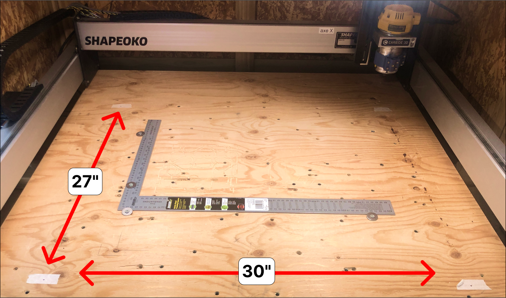

## Matériaux usinables

- Bois : Tous types de bois
    - Épaisseur de découpe du matériau possible : **1 pouce (25,4 mm) et moins**. Cela dépends des mèches que vous utiliserez (**inspecter les mèches et leurs boites**)
- Plastique
    - **Non usinable** (Nous n'avons pas de système d'aération pour expulser les fumées dégagées par le plastique)
- Métal
    - **Non usinable**
- Plaques de cuivre
    - Plaques de cuivre (de type FR1) pour la création des circuits imprimés

## Logiciels à utiliser

Carbide 3D fournit une **suite de 2 logiciels** conçu pour ses machines CNC (logiciels disponible uniquement en anglais):

1. **Carbide Create** 
   - Pour définir les paramètres de découpe et générer le fichier G-code (la liste d’instructions que la machine CNC devra suivre)
2. **Carbide Motion** 
   - Pour contrôler la machine CNC et exécuter le fichier G-code généré dans Carbide Create

:::note[Note]
Ce guide explique comment opérer la machine CNC pour réaliser une découpe à partir d'un dessin existant, mais il **ne couvre pas ici la création de dessins vectoriels**.
:::

## 1. Mise sous tension de la machine

Les interrupteurs et boutons pour démarrer la machine sont disponibles sur le côté gauche : 

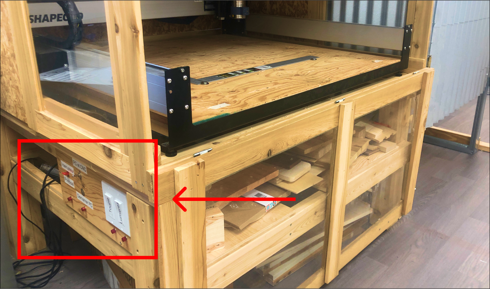

1. Activer l'interrupteur **Interrupteur Principal**
2. Activer l'interrupteur **PC et CNC**
3. Presser le bouton **Démarrer PC**
4. Activer l'interrupteur **Lumières**
5. **Ne pas toucher** à l'interrupteur **Toupie** pour le moment

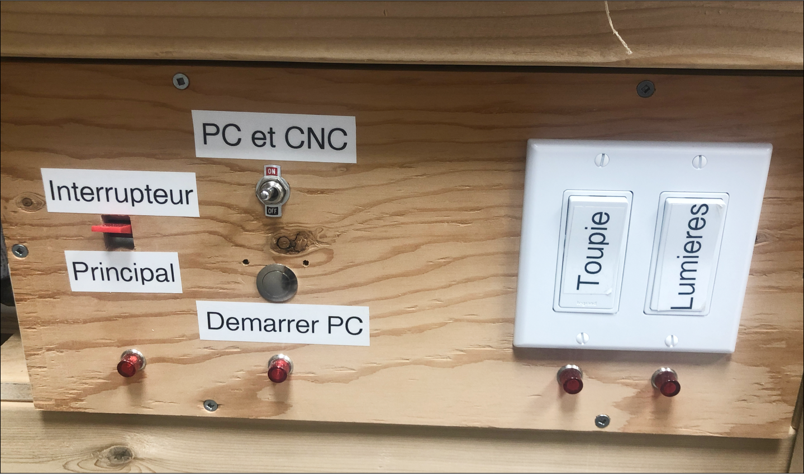

## 2. Préparation de la planche à découper
- Mesurer la planche à découper (largeur, longueur et épaisseur) à l'aide d'un mètre à ruban **SANS la placer pour le moment sur la zone de travail**. Cette étape interviendra ultérieurement.

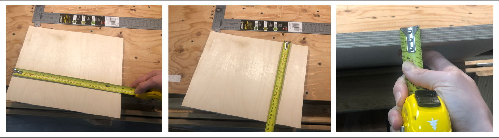

## 3. Utilisation du logiciel Carbide Create
- Ouvrir le logiciel

  

- Saisir dans le logiciel les dimensions de la planche
  - Dans le menu de gauche, dans la section **"Setup"** de l'onglet **"Design"**, cliquer sur l’icône en forme d’écrou. Une boite de dialogue va s'ouvrir.

  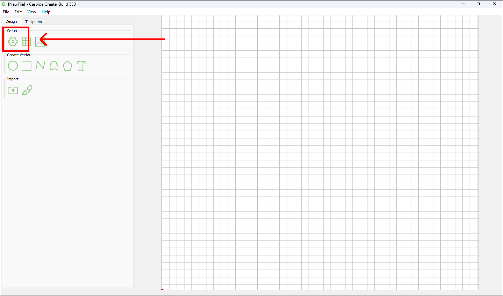

  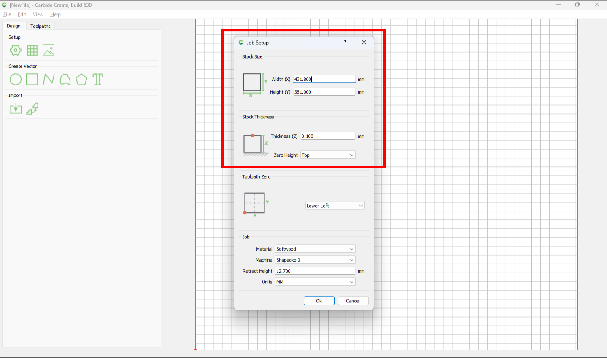

  - Dans cette fenêtre, saisir la largeur, la longueur **«Stock Size»** et l’épaisseur de votre matériau **«Stock Thickness»** à usiner en millimètres. Il est possible de changer l’unité de mesure dans cette fenêtre en cliquant sur le menu déroulant à droite de **«Units»** et en sélectionnant **«Inch»**. 
    <!-- - (vous pouvez aussi utiliser un convertisseur d'unité au besoin tel que <a href="https://www.wolframalpha.com/input?i=inch+mm" target="_blank" rel="noopener noreferrer">wolframalpha.com</a>) -->
  - Ne pas toucher à la variable **«Zero Height»** qui doit rester sur **«Top»** ni la section **«Toolpath Zero»** qui correspond à la position initiale de la machine (le point zéro rouge qui correspond à l'endroit où la machine débutera son travail). Généralement, c'est le coin inférieur gauche **«Lower Left»**.
  - Cliquer sur **«Ok»** pour enregistrer les informations saisies. En cliquant sur **«Ok»**, la fenêtre va se fermer et la zone de travail va se mettre à jour pour présenter un cadre **représentant les dimensions de votre matériau** (représenté en pointillé ci-dessous)

    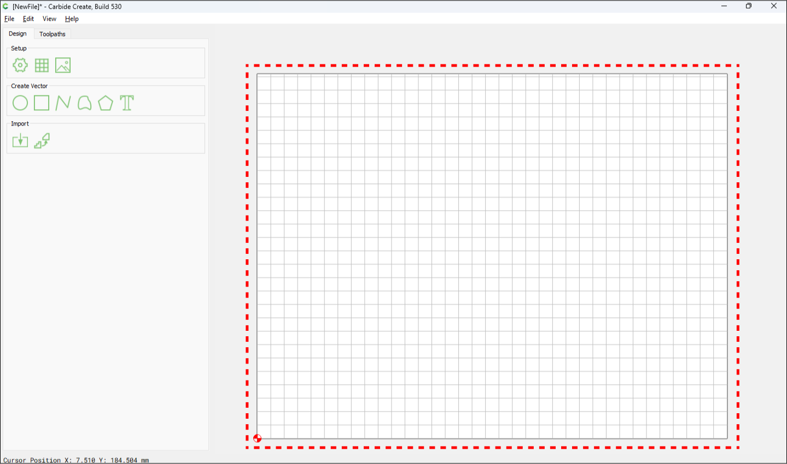

- Importer le dessin à usiner
    - Importer ensuite votre dessin à usiner au **format vectoriel (fichier de type .svg)** en cliquant sur le bouton **"Import"** de la section **"Import"**.
      - Au clic, une boite de dialogue va s'ouvrir et vous demander de sélectionner le fichier à importer. **Sélectionnez le fichier** et cliquez sur le bouton **«Ouvrir»**

    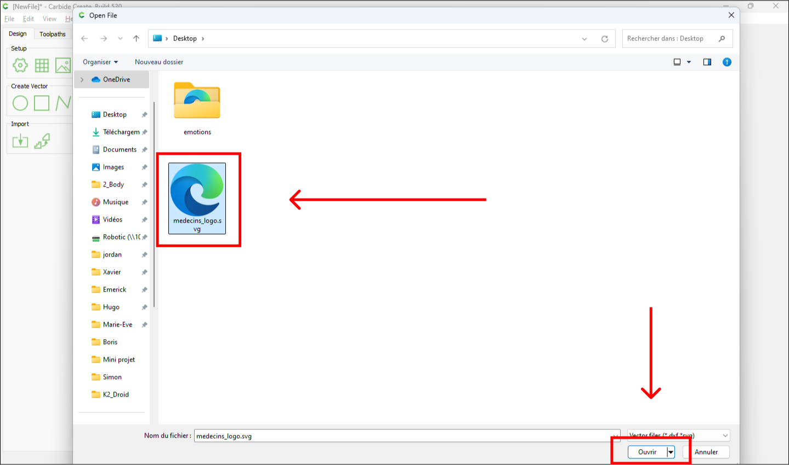

    - C'est maintenant l'étape de **vérifier les dimensions du dessin importé par rapport aux dimensions de votre planche**. Au besoin, mettre le dessin à l'échelle avec l'outil **"Scale"** dans la section **"Transform"** et positionnez ensuite votre dessin à l'endroit de votre planche où vous désirez éffectuer le l'usinage

      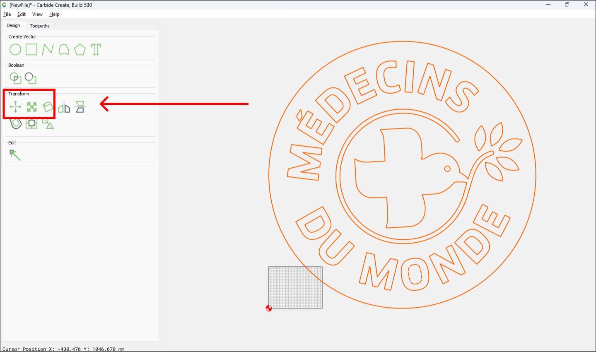

      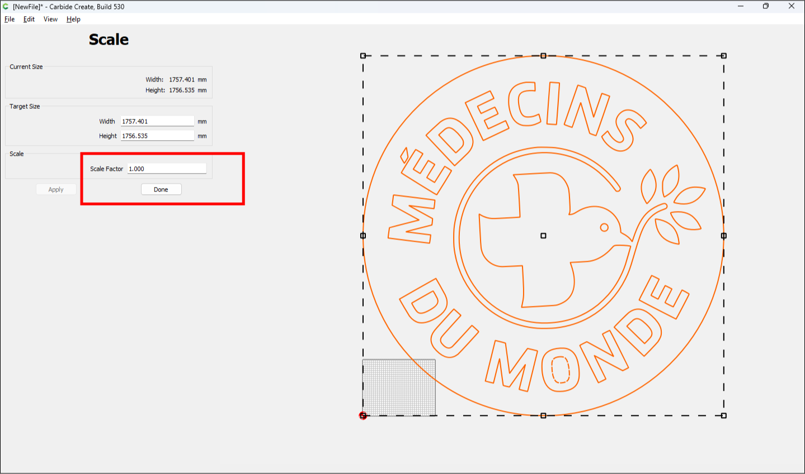

    - Cliquer sur **"Apply"** puis sur **"Done"**
- Paramétrez maintenant l'usinage à faire sur le dessin choisi
  - Sélectionner le ou les différents éléments du dessin. Le dessin s'affiche en orange lorsque sélectionné
  
    <!-- 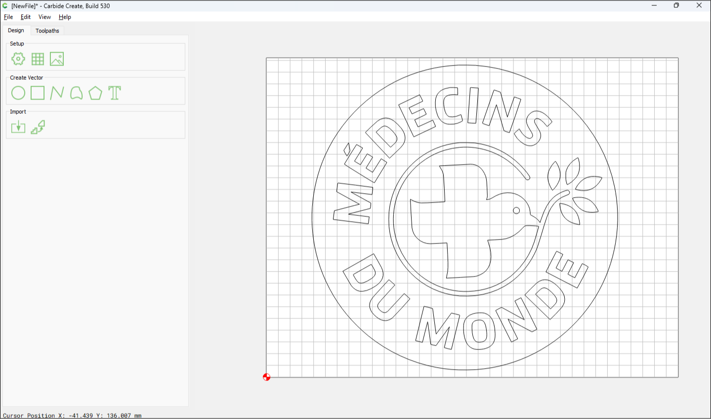 -->

    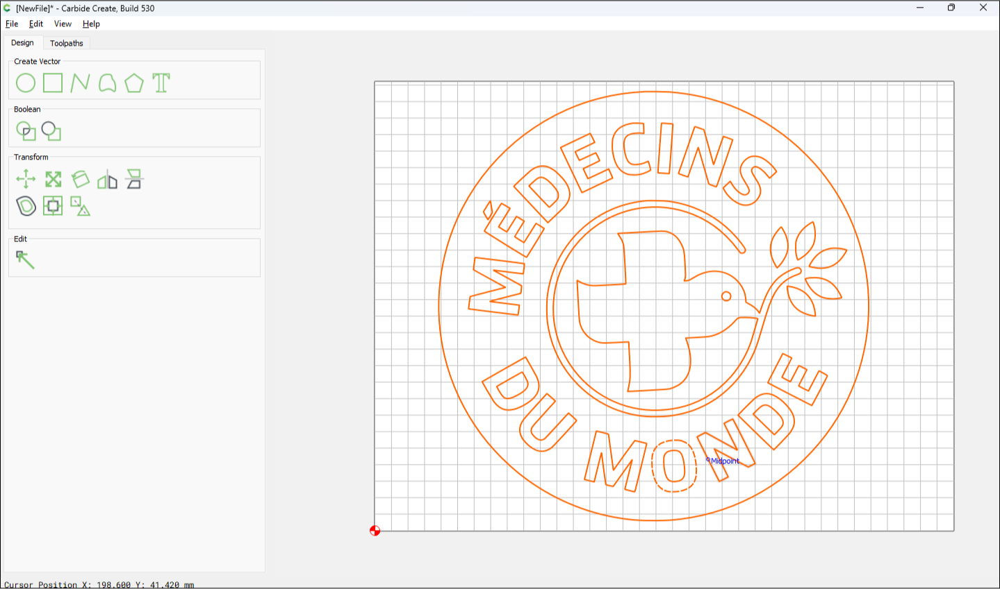

  - Cliquez ensuite sur l'onglet **"Toolpath"** à la droite de l'onglet **"Design"**
    - Plusieurs options de gravure sont disponibles dans la section "2D Toolpath":

        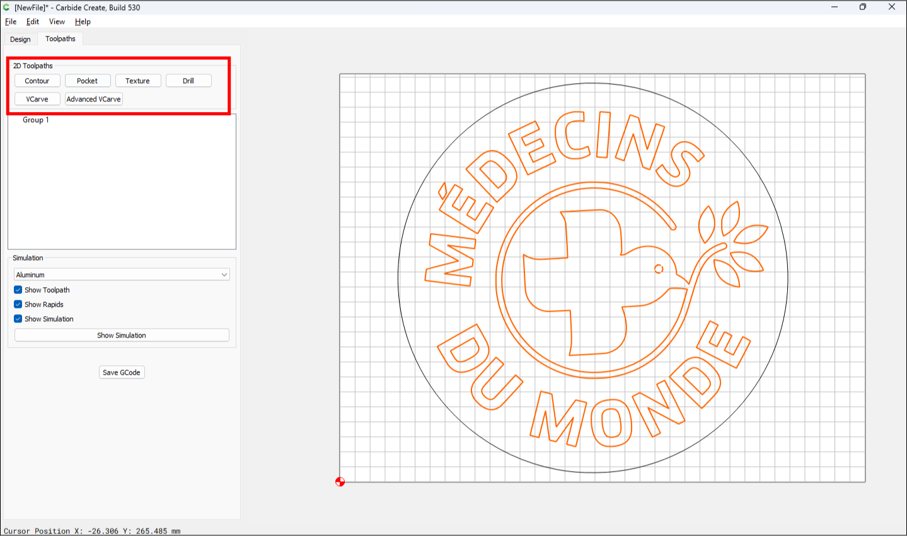

        - Sélectionner **«Contour»** pour graver les contours de l’objet
        - Sélectionner **«Pocket»** pour creuser tout l’intérieur de l’objet de façon uniforme
        - Sélectionner **«Texture»** pour creuser à l’intérieur d’un objet pour créer une texture en relief
        - Sélectionner **«Drill»** pour faire un trou dans un objet
        - Sélectionner **«VCarve»** pour graver l’intérieur d’un objet en produisant des côtés en angle (cette option est surtout utilisée pour le texte en surface)
    - Maintenant que vous avez sélectionné une option de gravure pour votre projet, il vous reste à sélectionner le choix de mèche à utiliser dans la sous-section **«Tool»** du sous-menu **«Contour Toolpaths»**

        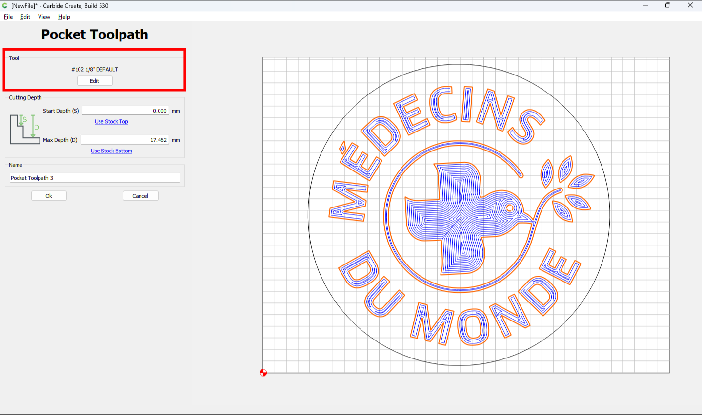

        - Cliquer sur **«Edit»** et une boite de dialogue va s'ouvrir 
        - Cliquer sur **«Select Tool»** permet d’accéder au module de sélection des mèches disponibles dans le logiciel

        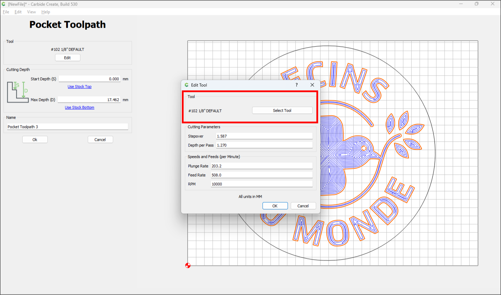

        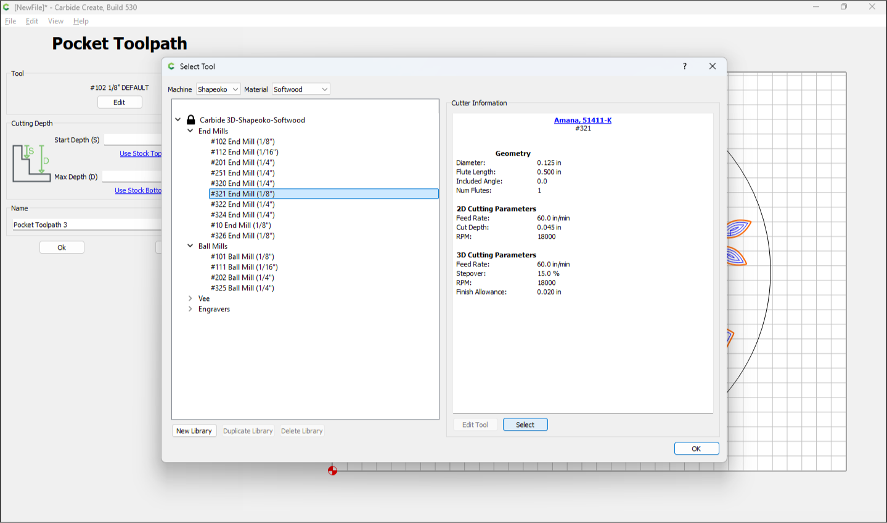

        - Voir ci-dessous le **tableau de correspondance** entre les mèches du module de sélection du logiciel Carbide Create et les mèches disponibles dans l'atelier (représenté en pointillé ci-dessous)

        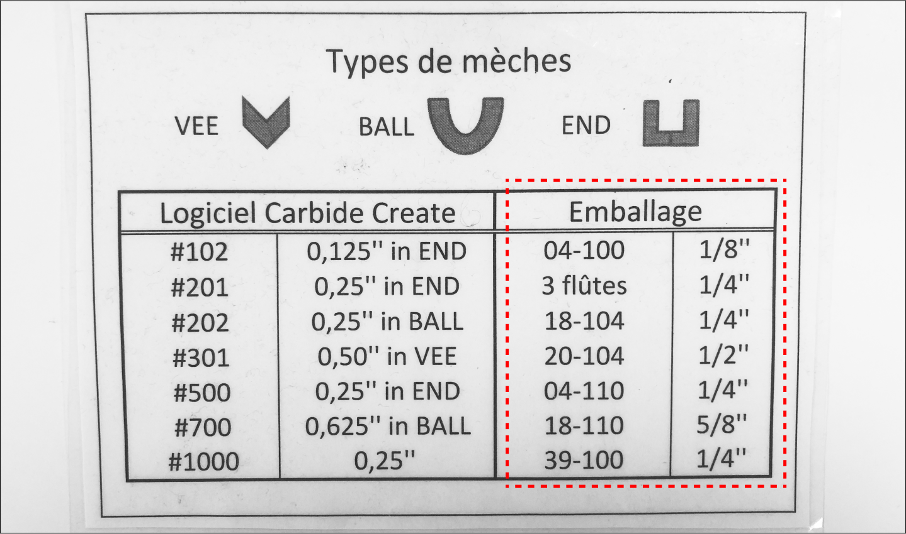

    - Définissez ensuite la profondeur de la découpe à effectuer dans la section **« Cutting Depth »**. Assurez-vous que la **mèche que vous aller installer dans la toupie est suffisamment longue** pour réaliser la découpe à la profondeur saisie.

        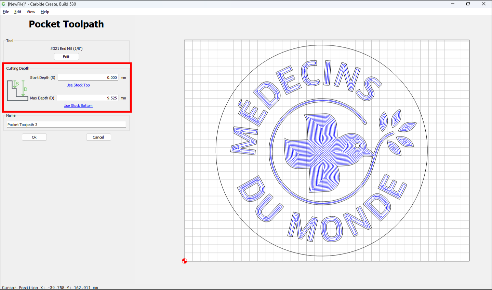

        - La première variable **«Start Depth» (S)** doit être à zéro puisque nous voulons commencer à fraiser à la surface du matériau. La deuxième variable, **«Max Depth» (D)** est la mesure de la profondeur maximale de la coupe (Par défaut, cette distance est mesurée à partir du dessus de la planche).
    <!-- - Définir la direction de décalage
        - Cette section « Offset direction » vous permet de choisir de quel côté passera la mèche en relation avec la découpe de votre dessin.   -->
    - Une fois que vous avez rempli les différentes sections, cliquer sur **«Ok»**

:::note[Conseil]
Dans le cas d'un dessin complexe, il faut définir l'ordre de la découpe à effectuer pour chaque groupe de dessins. Par exemple, il est préférable de commencer par découper les éléments intérieurs d'un dessin avant de terminer par les contours extérieurs : Cela permet de maintenir la stabilité de la pièce pendant la découpe.
:::

- Vérifier le parcours de la machine en le prévisualisant en appuyant sur **« Show simulation »**
    - Vous pouvez alors voir la simulation de la découpe

    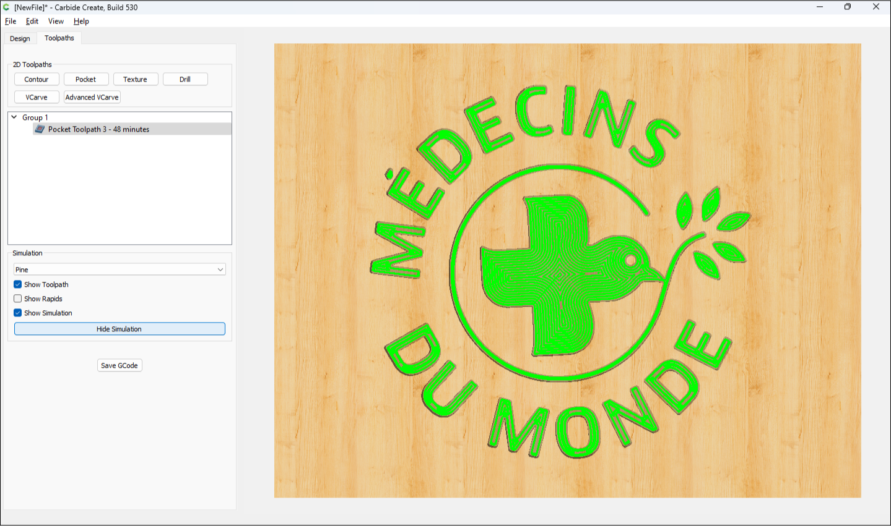

- Une fois les paramètres de découpes du dessin configurés, **enregistrer votre travail** et **exporter le dessin au format G-code** en lui donnant un nom (e.g ma_decoupe_cnc.gcode)

    

## 4. Utilisation du logiciel Carbide Motion
- Avant d'ouvrir le logiciel, vérifier tout d'abord que le **plan de travail de la machine CNC ne comporte aucun objet ou obstacle** sur la surface de travail

    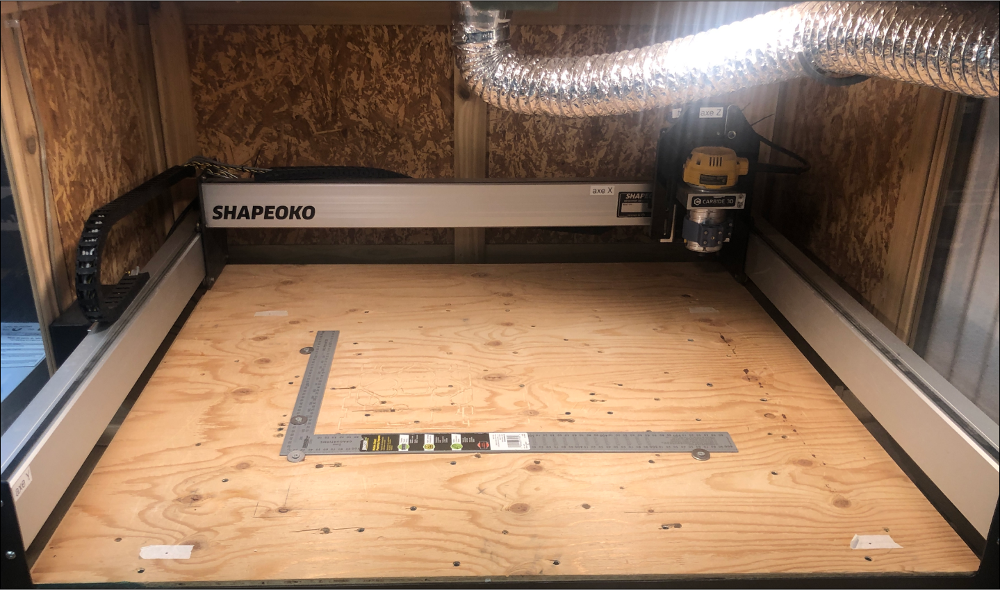

- Installation de la mèche sur la toupie
    - Sélectionner la mèche appropriée pour votre projet
        - Assurez vous que le diamètre de la queue de la mèche correspond au collet installé sur la toupie (le diamètre de la queue de la mèche doit être de **0,25″** inch soit 6.35 mm)
    - Insérer délicatement la queue de la mèche dans le collet correspondant de la toupie

        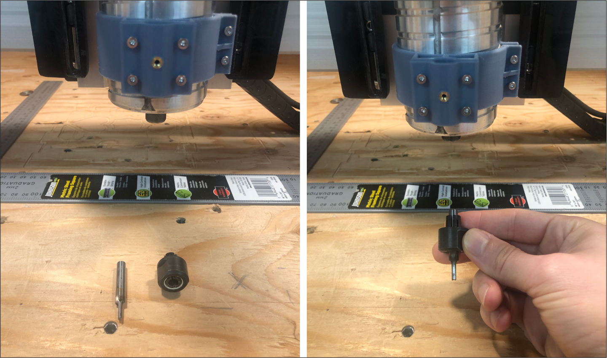

    - Serrage de la mèche
        - **Visser le collet avec la mèche** dans l'arbre de la toupie
        - Localiser le bouton de verrouillage jaune sur le **côté gauche de la toupie**
        - **Maintenir le bouton enfoncé** pour empêcher l'arbre de tourner
        - Utiliser une clé pour serrer fermement l'écrou du collet dans le **sens antihoraire** (ne pas serrer excessivement, pour ne pas endommager le collet ou la mèche)
        - **Relâcher** le bouton de verrouillage jaune

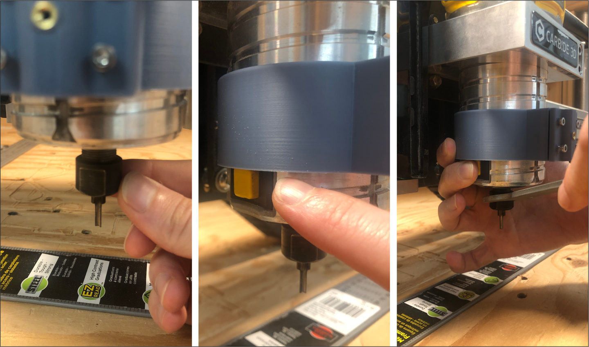

:::note[Note]
Après avoir relâché le bouton de verrouillage jaune, faire tourner doucement la mèche à la main pour vous assurer qu'elle est **correctement centrée et ne vacille pas** dans le collet. La mèche est maintenant correctement installée dans la toupie !
:::

- Sur la toupie compacte, sélectionner la vitesse de rotation à laquelle la mèche devra tourner en fonction de votre projet (**vitesse de rotation entre 1 et 6**)

  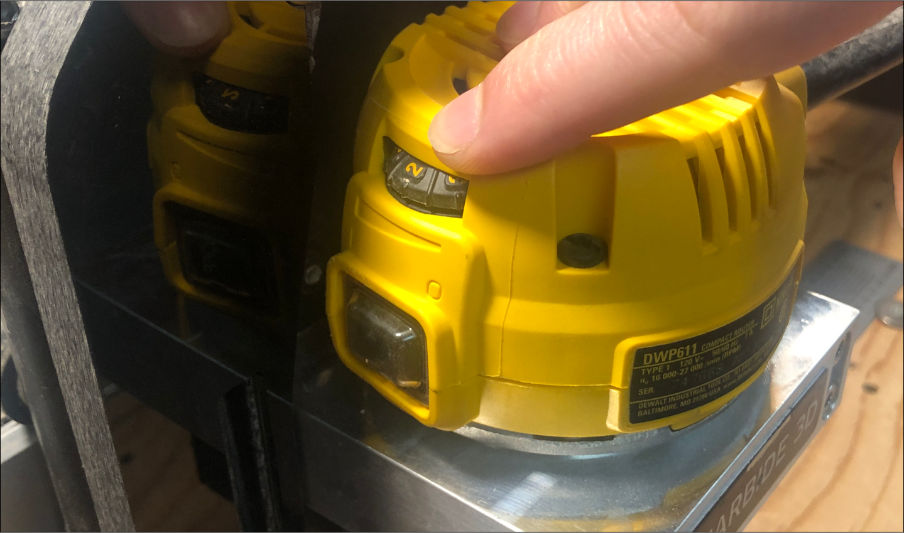

- Consultez ci-dessous le **tableau de correspondance** entre le réglage de la molette de sélection et la vitesse de rotation de la toupie

  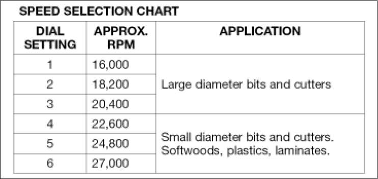

- Ouvrir maintenant le logiciel Carbide Motion

  

- Cliquer sur "Connect to cutter"

  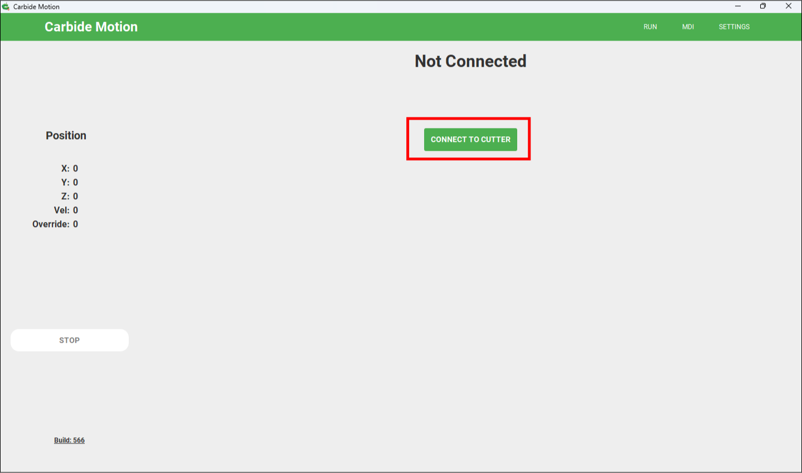

- Cliquer sur "Initialize machine"

  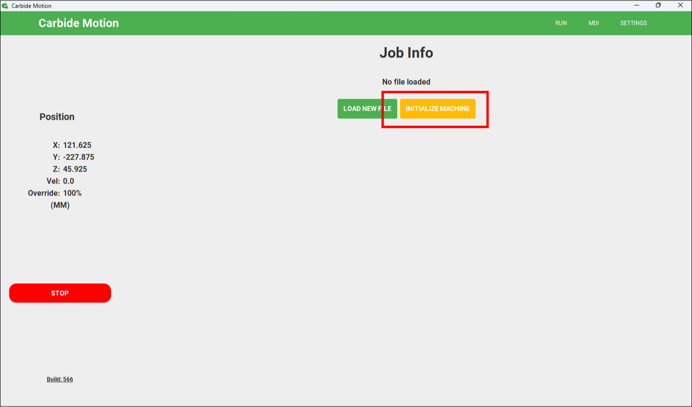

:::caution
Lorsque vous cliquez sur “Initialize machine”, la machine va se **déplacer automatiquement en position initiale**, il ne faut donc pas qu'elle rencontre des objets ou obstacles sur son chemin !
:::

:::note[Note]
Une fois que la machine s'est placée en position initiale et est à l'arrêt, **positionnez votre planche à découper sur la zone de travail en utilisant les cales de fixation**.
:::

- les cales de fixation maintiendront la planche pour qu’elle ne bouge pas pendant l’usinage

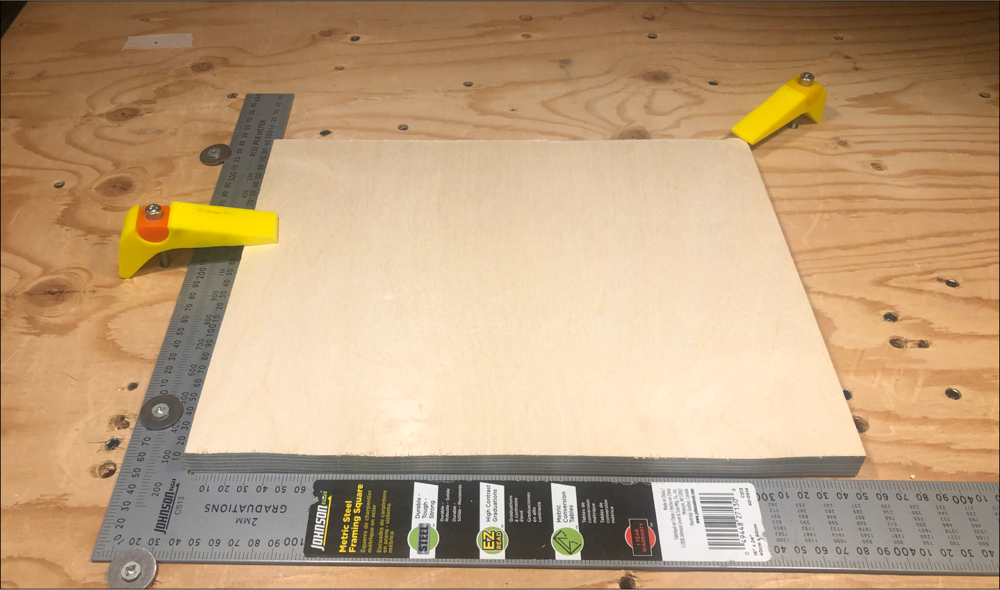

- Cliquer ensuite sur l'onglet **"JOG"**
    - Cet onglet vous permet de contrôler manuellement les mouvements de la toupie sur tous les axes (X, Y et Z) et sert à **définir le point de démarrage (point zéro) de la machine CNC**

    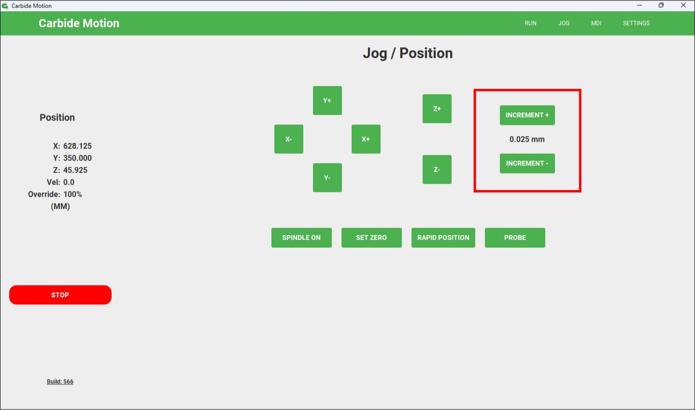

- Contrôle de la vitesse de déplacement
    - Repérez les boutons **«INCREMENT +» et «INCREMENT -»** sur l'interface de contrôle. Ces boutons permettent d'ajuster la vitesse de déplacement de la toupie sur le plan de travail.
    - L'incrément détermine la précision du mouvement de la toupie à chaque pression sur les boutons de déplacement X, Y et Z. Utilisez ces boutons pour augmenter ou diminuer l'incrément selon vos besoins.
- Choix de la vitesse
    - Pour un déplacement rapide : Augmentez progressivement l'incrément jusqu'à **«FAST»** (utilisez cette option avec prudence, surtout près des bords de la planche.)
    - Pour un ajustement précis : Diminuez l'incrément jusqu'à **«0.025mm»**. Cela permet un contrôle très fin du positionnement de la toupie.
- Positionner le point de départ de la machine

  - Ajustement sur les axes X et Y : Utilisez les commandes de l'onglet **"JOG"** pour déplacer la toupie sur les axes X et Y afin de **positionner la mèche à la position de départ souhaitée sur la planche**.

  - La toupie est maintenance placée dans sa position de départ :

    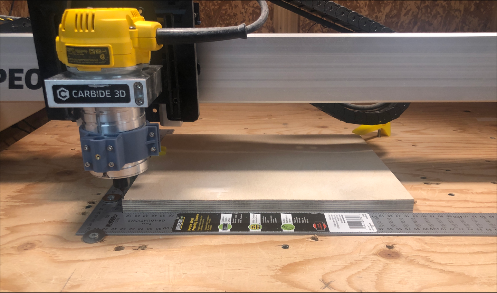

  - Ajustement sur l'axe Z : Utilisez les commandes de l'axe Z pour **abaisser délicatement la toupie jusqu'à ce que la mèche effleure la surface de la planche**.

    :::caution
    Faites attention lors de l'abaissement de la tête avec la mèche. Un contact trop brusque pourrait endommager la mèche ou la planche.
    :::

    :::note[Note]
    Utilisez une feuille de papier standard comme jauge d'épaisseur. La mèche doit tout juste pincer le papier sans le déchirer.
    :::

    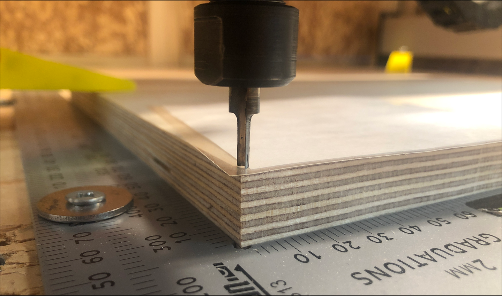

- Vérification finale: confirmez visuellement que la position de départ de la mèche est correcte sur tous les axes.

    :::caution
    Assurez-vous que les cales de fixation ne se retrouvent pas sur le trajet de la mèche lors de la découpe. 
    :::

- Une fois le positionnement de la machine vérifié :
  1. Cliquer sur **"Set Zero"**
  2. Cliquer sur **"Done"** pour confirmer le positionnement de la machine CNC dans sa position de départ

:::note[Astuce]
Vous pouvez **noter (ou prendre une photo) la position finale de la toupie sur les axes X, Y et Z**. Cela pourra vous être utile pour référence future ou en cas de réinitialisation de la machine.
:::

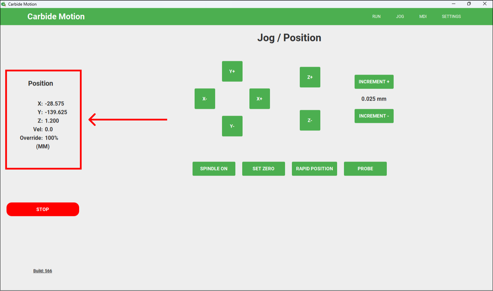

- Cliquer ensuite sur **"RUN"**
  - Sélectionner **"Set current location as zero"**
  - Cliquer sur **"LOAD NEW FILE"**
  - Ouvrir le fichier G-code généré (e.g ma_decoupe_cnc.gcode) dans l'étape précédente avec Carbide Create
  - Cliquer sur **"Done"**

- Mettre l'aspirateur en place sur la toupie

- Vérifier que la trappe de ventilation à l'arrière de la machine CNC est **complètement ouverte**

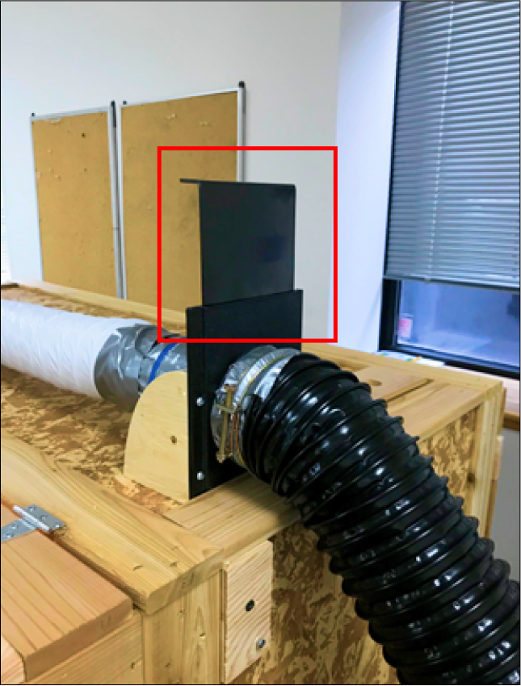

- Allumer le système de ventilation à l'intérieur de la cabine métallique

- Fermer le capot de protection de la machine CNC

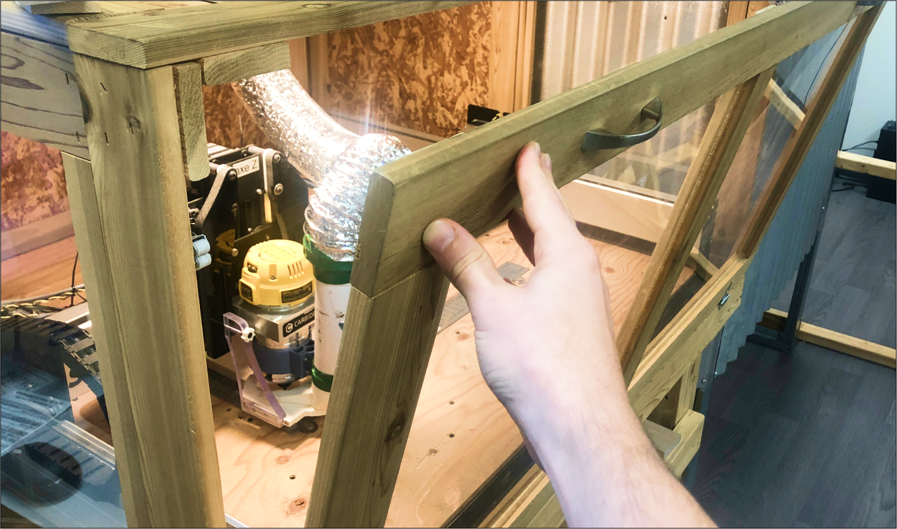

:::danger[Attention]
Ne jamais démarrer la machine CNC avec le capot de protection ouvert
:::

- Activer maintenant l'interrupteur **Toupie** sur le côté gauche de la Machine CNC
    - La toupie va alors se **mettre à tourner en fonction de la vitesse de rotation que vous avez définie précédemment sur la toupie** (rappel: vitesse de rotation entre 1 et 6)

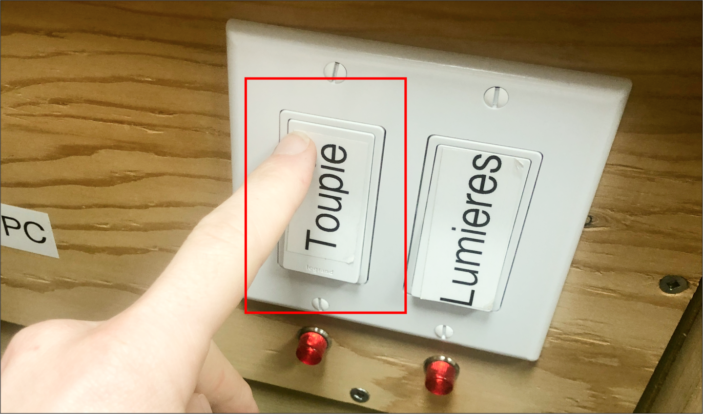

- Démarrer maintenant la machine
    - Cliquer sur **"START JOB"**
    - Cliquer sur **"START"**
    - Confirmer en cliquant à nouveau sur **"START"**
    - Cliquer sur **"Resume"**

:::note
La machine CNC va maintenant **effectuer l'usinage de votre pièce en suivant les instructions du fichier G-code**. Pendant l'usinage, la progression de la découpe et le temps restant estimé sont **affichés en temps réel** dans le logiciel.
:::

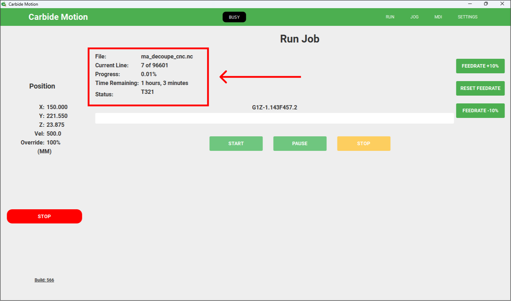

:::danger[Attention]
- **Ne jamais laisser la machine sans surveillance** pendant la durée de son fonctionnement
- En cas d'anomalie ou de danger, utilisez immédiatement le **bouton d'arrêt d'urgence "Interrupteur Principal"** sur la gauche de la machine ou via l'interface en cliquant sur le bouton **"STOP"** dans le logiciel Carbide Motion.
:::

## 5. Nettoyage après utilisation

:::caution
Assurez-vous que la machine a terminé son travail et qu'elle est **arrêtée et éteinte** avant de commencer le nettoyage
:::

1. Arrêt et sécurisation :
   - Désactiver la toupie en appuyant sur l'interrupteur **"Toupie"** et attendre son arrêt complet
2. Ouverture et retrait :
   - Ouvrir le capot de protection de la machine
   - Enlever les cales de fixation et retirer la planche usinée de l'habitacle de la machine CNC
3. Nettoyage :
   - Utiliser l'aspirateur pour éliminer les copeaux de bois et la poussière
   - Nettoyer les rails de guidage avec un chiffon propre
   - Nettoyer la tête de la toupie
   - Une fois le nettoyage complet, éteindre le système de ventilation
   - Eteindre le système de ventilation
4. Eteindre l'ordinateur :
  - Désactiver l'interrupteur **"PC et CNC"**

## Pour aller plus loin

- Consultez la <a href="https://docs.carbide3d.com/" target="_blank" rel="noopener noreferrer">documentation officielle de Carbide 3D</a> pour des informations détaillées sur le logiciel et le matériel.

- Un adaptateur imprimé en 3D est installé sur l'arbre de la toupie pour utiliser des feutres (type Sharpie) à la place des mèches. Cet adaptateur vous permettra de **dessiner sur des supports comme du papier ou du bois, au lieu de réaliser une opération de fraisage**.