Ce guide vous accompagne pas à pas dans l'utilisation de la machine de gravure laser. Elle est principalement utilisée pour graver des matériaux à l'aide d'un faisceau laser focalisé qui crée des marques de surface en fonction des réglages de puissance et de vitesse de la machine.

## Sécurité personnelle

- La sécurité est essentielle lors de l'utilisation du graveur laser. Il est donc impératif de respecter les règles suivantes :
  - Portez toujours des lunettes de protection conçues pour le laser.
  - Ne jamais regarder directement le faisceau laser sans lunettes de protection
  - Ne jamais utiliser le graveur laser lorsque le couvercle de protection est ouvert.
  - S'assurer que le système de ventilation fonctionne avant de commencer tout travail.
  - **Ne laissez JAMAIS la machine sans surveillance** pendant qu'elle fonctionne, car un incendie pourrait se déclarer et se propager rapidement.
  - Avant d'utiliser la machine de gravure laser, repérez à proximité notre **extincteur**, la **couverture ignifuge** et le bac de **lunettes de protection**.       
    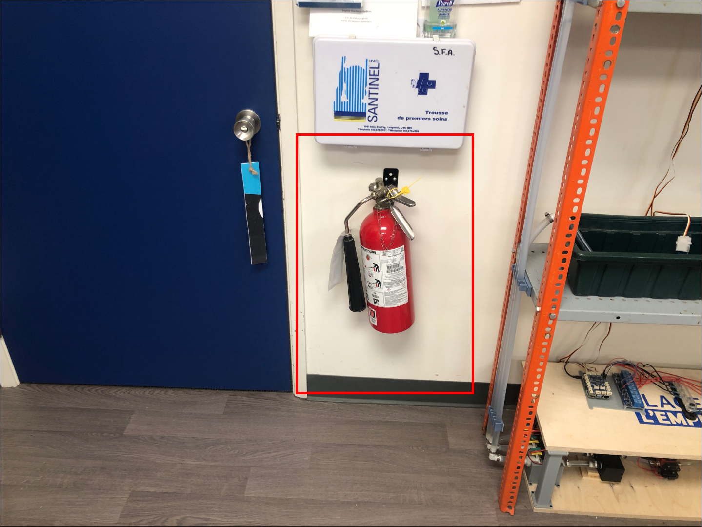
    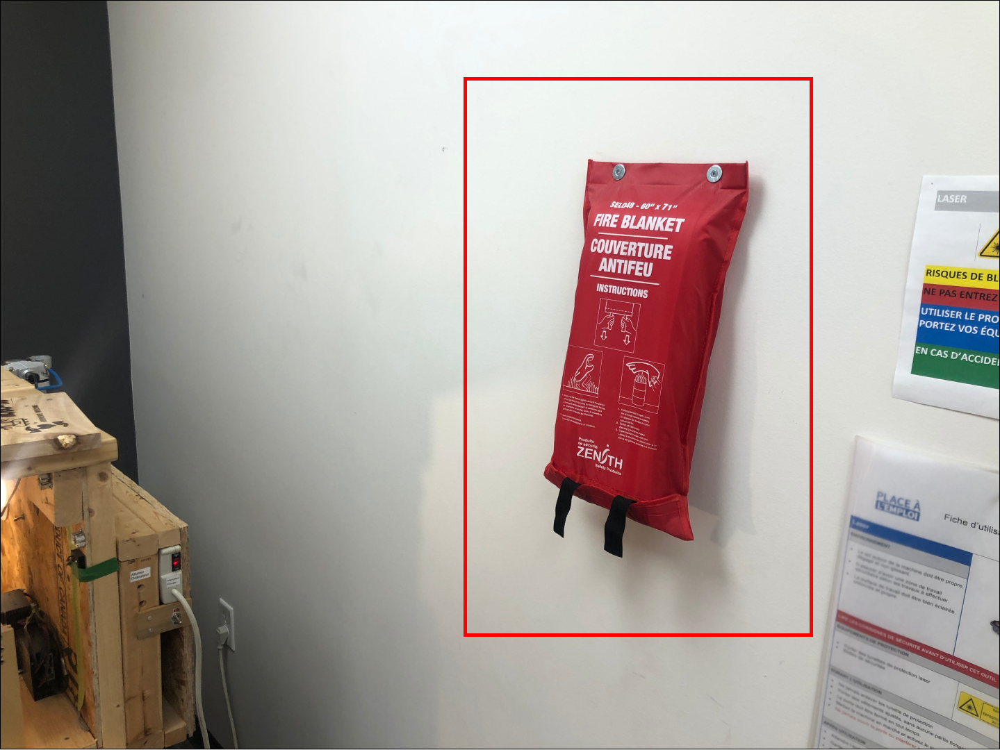
    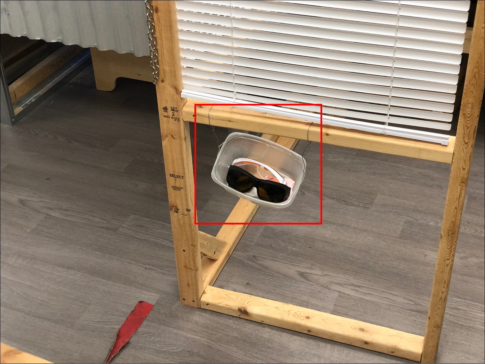

## Référence matérielle

- Spécifications du laser:
    - Type de Laser: Diode laser module N40630
    - Puissance: 5W (sortie optique)
    - Longueur d'onde : 450nm (bleu)
    - Caractéristiques du faisceau :
        - foyer : ~0,1 mm
        - Forme du faisceau : Elliptique
- La longueur focale du laser que nous utilisons typiquement est de 2.5 pouces.
- Les spécifications du module laser utilisé sont basées sur les détails énumérés sur la <a href="http://wiki.nejetool.com/doku.php?id=laser_module_406030w" target="_blank" rel="noopener noreferrer">page de spécifications du module laser du Wiki NEJE</a>. Veuillez consulter la page de référence (en anglais) pour obtenir des informations supplémentaires sur l'installation et la maintenance.

## Glossaire
- **G-code** : Un langage de programmation utilisé pour contrôler les machines-outils automatisées
- **Fichier vectoriel (SVG)** : Un type de fichier image qui utilise des formules mathématiques pour créer des graphiques, idéal pour les logos et le texte.
- **Fichier matriciel (PNG, JPG)** : Un type de fichier image composé de pixels, idéal pour les photographies.
- **Longueur focale** : La distance optimale entre le laser et le matériau pour obtenir les meilleurs résultats de gravure.

## Surface de travail
- La surface de travail, indiquée par des marques de ruban adhésif à chaque coin, est de 29,5 pouces  (largeur) × 26 pouces (longueur) (soit 74,93 cm × 66,04 cm). La taille du matériau qui peut s'adapter à l'enceinte peut aller jusqu'à 36 × 36 pouces.

    

- Le module laser peut être réglé sur l'axe Z en utilisant la plage suivante : 0-30mm

## Matériaux usinables

- Matériaux autorisés
    - Tous les types de bois
        - Bois naturel
        - Contreplaqué
        - MDF
    - Papier et carton
    - Cuir et tissus
        - Cuir naturel uniquement (non teinté ou sans chrome)
- Matériaux interdits
    - Plastique
        - Interdit en raison de l'absence de système de ventilation pour traiter les fumées nocives.
    - Métal
        - Le laser à diode n'est pas assez puissant pour graver le métal
    - Tout métal réfléchissant : verre

## Processus de travail avec le logiciel

Pour faire fonctionner le graveur laser, nous utilisons actuellement **LaserWeb**, un logiciel libre conçu pour contrôler les machines de découpe laser.

Le processus de travail de la gravure laser suit les étapes suivantes :
1. Préparation du dessin (fichier vectoriel ou matriciel)
2. Importation du dessin dans LaserWeb
3. Vérification ou redimensionnement des dimensions du dessin ou modèle
4. Réglage des paramètres de gravure
5. Générer le Gcode pour la machine
6. Exécution du travail
7. Arrêter la machine en toute sécurité

## 1. Mise sous tension de l'appareil

Le graveur laser est équipé de **multiples interrupteurs de commande situés sur les différentes parties de la machine**.

- Commandes sur le panneau avant:
  
  - **Interrupteur d'alimentation principal** : cet interrupteur permet de mettre l'ordinateur sous tension.
  - **Interrupteur du serveur laser** : Cet interrupteur active le serveur de contrôle de la machine laser. Ne l'utilisez qu'une fois l'ordinateur entièrement démarré.
- Commandes montées sur le dessus de la machine :
  
  - Un compresseur d'air est situé en haut à droite de la machine et sert à fournir un courant d'air ciblé pour refroidir le matériau pendant la gravure.
    - Ne l'activez pas encore - nous le mettrons en marche avant de commencer le travail.
- Intérieur de l'habitacle
  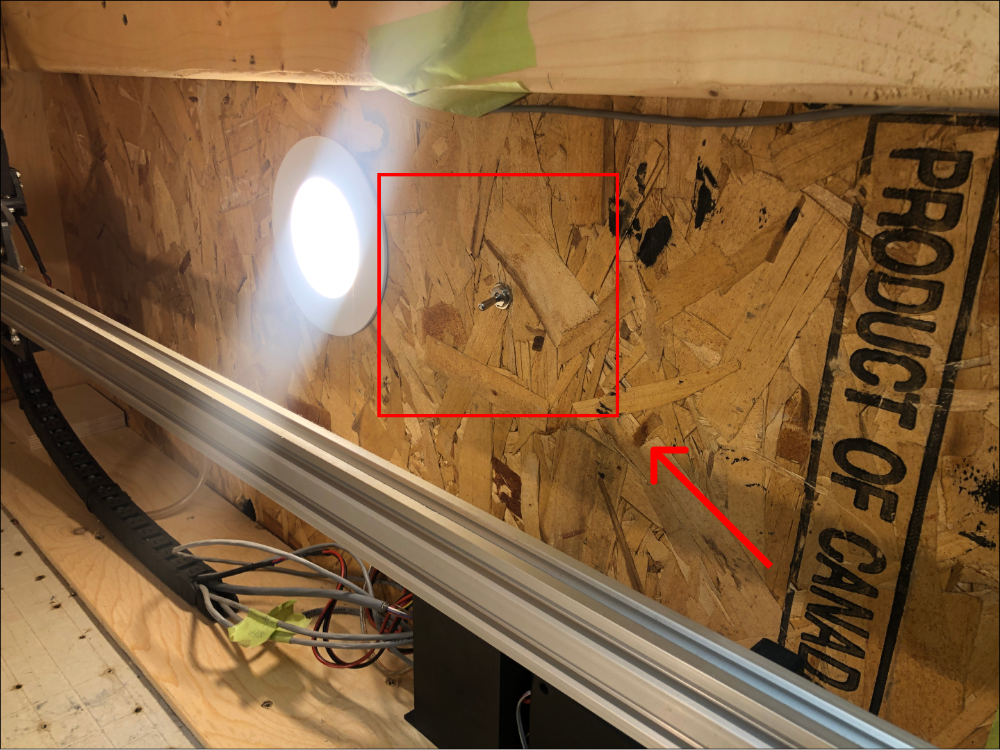
  - L'interrupteur d'activation du laser est situé sur la paroi intérieure droite du boîtier et alimente le module de la diode laser.
    - Ne l'activez pas encore - nous le mettrons en marche avant de commencer le travail.

## 2. Utilisation du logiciel LaserWeb

- Ouvrez LaserWeb à partir du raccourci du bureau

  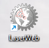

- Importez le dessin :
  - Cliquez sur le bouton « Add Document » et sélectionnez le dessin à utiliser.
  
    - Formats pris en charge :
        - Vectoriel (SVG) : Meilleur pour les logos, le texte et les dessins au trait
        - Raster (PNG, JPG) : Meilleur pour les images photographiques
  - Une fois le dessin ajouté, vous pouvez le visualiser sur la page.
  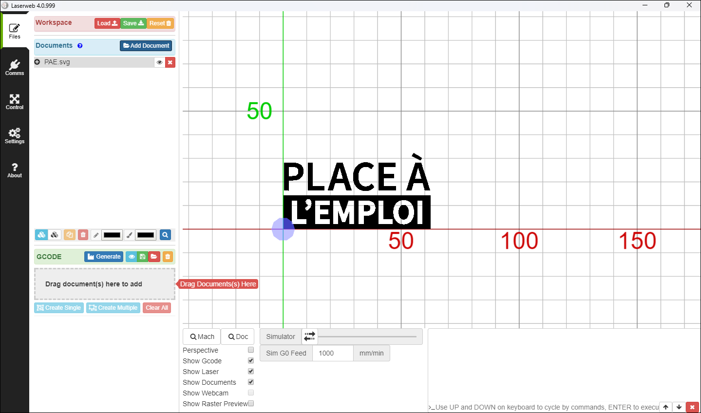

- Ajuster la taille du dessin
  - Sélectionnez le dessin et regardez les dimensions actuelles du dessin importé (en mm) dans le panneau propriétés. Pour le redimensionner, il suffit de sélectionner le dessin dans la barre latérale et d'entrer les nouvelles dimensions en millimètres dans le panneau propriétés.
  

- Ajuster la position du dessin dans l'espace de travail
  - SSélectionnez le dessin et cliquez sur l'icône de la flèche en haut à droite pour aligner le dessin sur l'origine de la machine.
  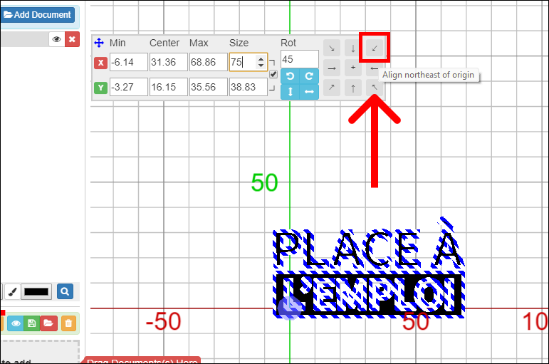

- Configurer les paramètres de gravure
    1. Ensuite, sélectionnez le dessin et faites-le glisser dans la section **GCODE**
      
    2. Sélectionnez l'un des différents types d'opération (dans cet exemple, nous sélectionnons **Laser Fill Path**) :
      
        - Laser Fill path: Pour remplir les zones solides (recommandé pour la plupart des opérations de gravure impliquant des fichiers vectoriels)
        - Laser Raster Merge: Pour créer des images détaillées en niveaux de gris
        - Laser Cut Outside: Pour découper le périmètre extérieur des dessins en gravure laser, afin de créer des contours nets autour du motif gravé
    3. Réglez les paramètres de gravure :
        - Line Distance (mm): Définit l'espacement entre les lignes de gravure. Un espacement plus faible améliore la résolution mais augmente le temps de traitement (nous réglons généralement la distance à 0,2).
        - Laser Power (0-100%): règle l'intensité du laser.
        - Passes: Spécifie combien de fois le laser va tracer sur la même zone.
        - Cut Rate (in mm/s): Détermine la vitesse de déplacement du laser. Les vitesses plus lentes créent des gravures plus profondes mais peuvent brûler le matériau.
        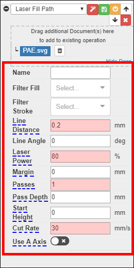
        
        :::note[Advice]
        Les paramètres de gravure présentés ci-dessus permettent de graver un logo (format SVG) sur du contreplaqué.
        Veuillez noter que chaque matériau peut nécessiter des paramètres de gravure uniques.
        :::

    4. Prévisualisation de la gravure
        1. Cliquez sur le bouton **Generate Gcode**
        
        2. Dans l'espace de travail, décochez **Show Gcode** et **Show Documents**. Seule la case **Show Laser** devrait être cochée pour vous permettre de prévisualiser le travail de gravure laser.
        

## 3. Préparation du matériel

- Préparation du matériau
  - Nettoyer la surface du matériau pour éliminer toute trace de poussière ou de débris.
  - S'assurer que le matériau à graver est plat
- Positionnement sur le lit
  - Placez le matériau sur le lit du graveur laser, à l'écart des bords du lit.
  - Aligner le matériau parallèlement aux axes de la machine si possible
  - Réglage de la hauteur (axe Z) :  
    - Si nécessaire, utilisez des blocs d'espacement pour surélever la surface du matériau. Réglez la hauteur de manière à ce que la surface supérieure du matériau se trouve à environ 1 à 2 pouces de l'extrémité de la tête du laser.
  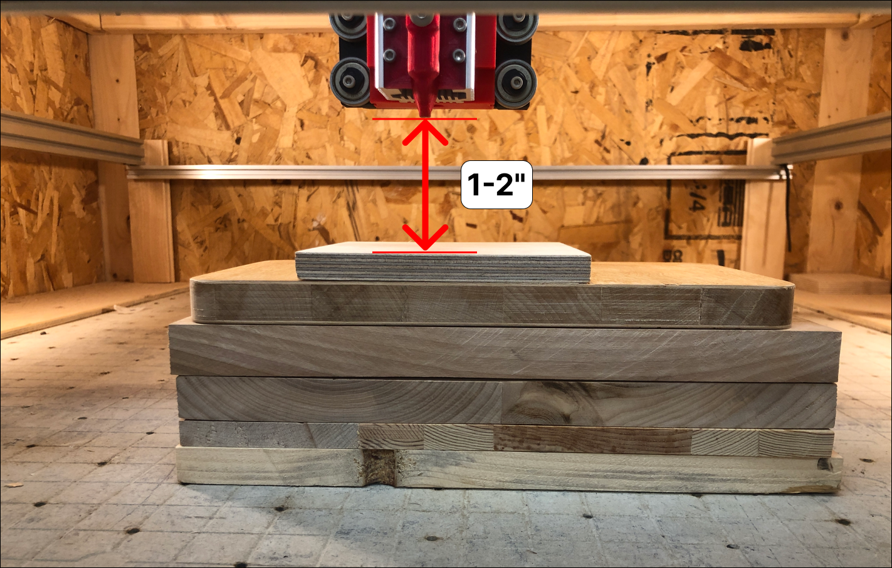

## 4. Positionnement de la tête du laser

- Connexion à la machine de gravure laser
    - Allez dans l'onglet **Comms** et cliquez sur le bouton **Connect**
    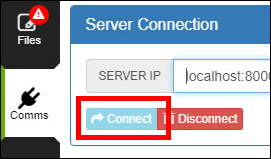
- Positionnement initial
    - Allez maintenant dans l'onglet **Control**
    - Cliquez sur l'icône **home all** pour déplacer le laser vers l'origine de la machine (en bas à gauche) et **attendez que le mouvement soit terminé** avant d'activer l'interrupteur du laser.
    
    - **Activer l'interrupteur laser** à l'intérieur de l'habitacle
        
        :::danger
        Portez toujours des lunettes de sécurité avant d'activer le laser.
        :::

- Alignement du laser
    - Activez le pointeur laser en cliquant sur **Laser Test**
    
    - Positionner la tête du laser sur les axes X et Y
      - Utilisez l'onglet de contrôle pour déplacer le laser sur les axes X et Y afin de **positionner le laser à la position de départ souhaitée sur le matériau**.
    
    - Positionner la tête du laser sur l'axe Z
      - Les boutons **jog by** contrôlent la distance à laquelle le laser se déplace à chaque pression des boutons directionnels sur les axes X, Y et Z.
      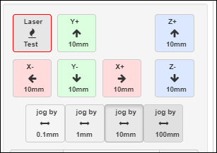
      - Utilisez les commandes pour abaisser doucement le laser jusqu'à ce qu'il y ait **exactement 1 pouce** entre la pointe du laser et le matériau à graver.
      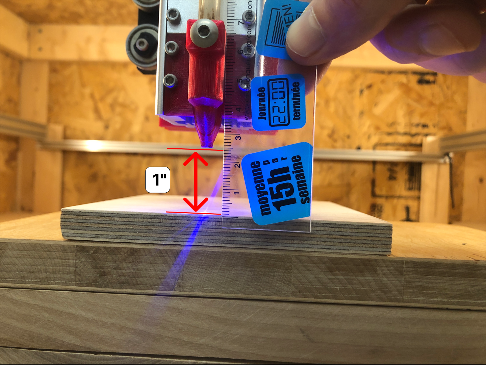

- Configuration finale
    - Une fois la tête laser correctement positionnée sur les trois axes, cliquez sur le bouton **Set Zero** pour enregistrer la position du laser.
    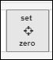
    - Enfin, cliquez sur le bouton **Check Size** pour vérifier que le laser trace correctement le contour du dessin sur le matériau.
    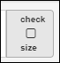
        :::note[Advice]
        Vous pouvez cliquer plusieurs fois sur le bouton **Check Size** si nécessaire pour obtenir une confirmation visuelle claire du contour du laser.
        :::

## 5. Exécution de la tâche

- Activez le compresseur d'assistance à l'air situé en haut à droite de la machine.

- Vérifiez que la trappe d'aération située à l'arrière de la machine laser est **complètement ouverte**.

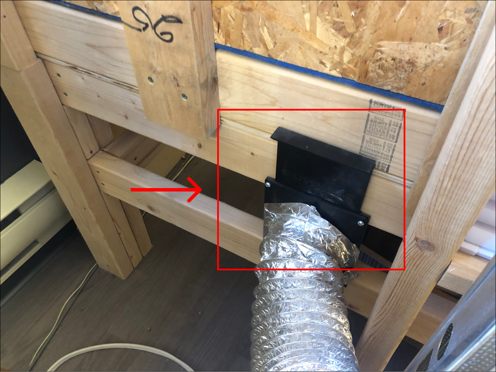

- Activez le système de ventilation à l'intérieur de la cabine métallique

- Fermez le capot de la machine laser

    :::danger[Attention]
    Ne jamais démarrer la machine à graver au laser lorsque le capot de protection est ouvert
    :::

- Démarrez la machine en cliquant sur **Start job**

    

    :::note
    La machine laser va maintenant **commencer le processus de gravure**. Le nombre d'instructions restantes sera **affiché en temps réel** dans le logiciel dans la section **Queued**.
    :::

- Vous pouvez toujours surveiller le processus de gravure à travers la fenêtre située en haut du boîtier (encore une fois, utilisez toujours vos lunettes de protection lorsque vous regardez le module laser).

:::danger[Attention]
- **Ne laissez JAMAIS la machine sans surveillance** pendant son fonctionnement
- En cas d'anomalie ou de danger, utilisez immédiatement l'**interrupteur général** en façade de la machine ou via le logiciel LaserWeb en cliquant sur le bouton **abort job**.
:::

## 6. Nettoyage après utilisation

:::caution
Assurez-vous que la machine a terminé son travail et qu'elle est **arrêtée** complètement et attendez que la ventilation élimine **les fumées** avant d'ouvrir le boîtier et de retirer votre matériel gravé.
:::

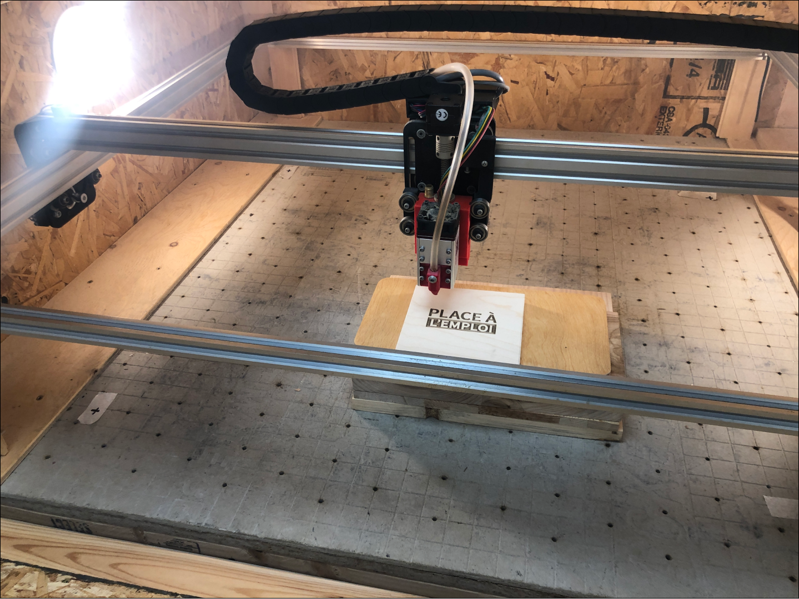

- Laisser refroidir le matériel avant de le retirer ou de le manipuler
- Éteindre les systèmes dans l'ordre inverse :
    - Compresseur d'air
    - Ventilation
    - Interrupteur laser
    - Serveur laser
    - Alimentation principale

## 7. Entretien

Bien que ce module utilise une ventilation interne, une utilisation à long terme peut ne pas empêcher la poussière ou une petite quantité de fumée d'affecter la lentille. Il est donc recommandé de nettoyer la lentille avec un coton-tige propre et de l'alcool isopropylique. La poussière ou la fumée en continu peuvent endommager la lentille.

## Dépannage

Problèmes courants et solutions :

- **Laser trop lent** : Vérifiez que l'**Unité de vitesse** (vitesse de déplacement de la tête du laser) en **mm/s ou mm/min** est réglée de manière appropriée pour les valeurs que vous avez saisies.
- **Profondeur de gravure inégale** : Vérifiez que la surface du matériau est parfaitement plane et que la longueur focale est correctement réglée.
- **Mauvaise qualité d'image** : Assurez-vous que le format de fichier est correct (vectoriel pour les textes/logos, matriciel pour les photos) et vérifiez la résolution du dessin.
- **La machine ne répond pas** : Vérifiez que tous les interrupteurs sont allumés, vérifiez la connexion ordinateur-machine, redémarrez le logiciel LaserWeb au besoin.

## Pour aller plus loin

- Envisagez d'expérimenter d'autres options logicielles pour faire fonctionner la machine laser afin d'explorer les fonctions supplémentaires offertes par les programmes de gravure laser (par exemple, LightBurn, LaserGRBL, etc.).